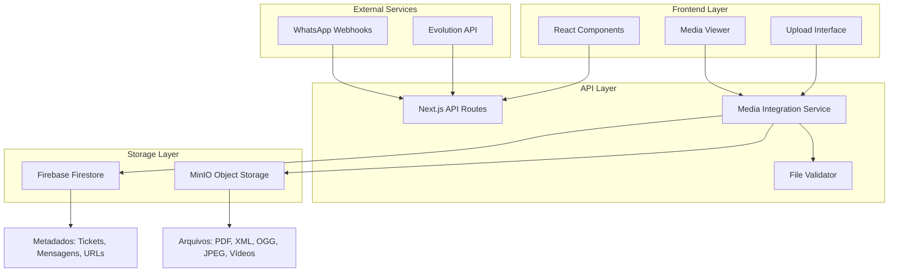

# Arquitetura Técnica: Integração MinIO

## 1. Visão Geral da Arquitetura

A nova arquitetura implementa um sistema híbrido onde o Firebase Firestore mantém os metadados e o MinIO armazena os arquivos físicos, garantindo eficiência de custos e performance.

### 1.1 Componentes Principais



## 2. Definições de API

### 2.1 Endpoints de Upload

#### POST /api/media/upload

**Request:**

| Parâmetro | Tipo   | Obrigatório | Descrição                  |
| --------- | ------ | ----------- | -------------------------- |
| file      | File   | true        | Arquivo para upload        |
| messageId | string | true        | ID da mensagem             |
| ticketId  | string | true        | ID do ticket               |
| mimeType  | string | false       | Tipo MIME (auto-detectado) |

**Response:**

| Parâmetro | Tipo    | Descrição                    |
| --------- | ------- | ---------------------------- |
| success   | boolean | Status do upload             |
| url       | string  | URL do arquivo no MinIO      |
| fileName  | string  | Nome normalizado do arquivo  |
| size      | number  | Tamanho em bytes             |
| error     | string  | Mensagem de erro (se houver) |

**Exemplo:**

```json
{
  "success": true,
  "url": "https://n8n-minio.05pdov.easypanel.host/crm-media-files/images/2025/01/document_1755808000000.jpg",
  "fileName": "document_1755808000000.jpg",
  "size": 245760,
  "mimeType": "image/jpeg"
}
```

#### GET /api/media/download/:messageId

**Response:**

| Parâmetro | Tipo   | Descrição                |
| --------- | ------ | ------------------------ |
| url       | string | URL de download direto   |
| fileName  | string | Nome original do arquivo |
| mimeType  | string | Tipo MIME                |
| size      | number | Tamanho em bytes         |

### 2.2 Endpoints de Validação

#### POST /api/media/validate

**Request:**

| Parâmetro | Tipo   | Obrigatório | Descrição        |
| --------- | ------ | ----------- | ---------------- |
| fileName  | string | true        | Nome do arquivo  |
| mimeType  | string | true        | Tipo MIME        |
| size      | number | true        | Tamanho em bytes |

**Response:**

```json
{
  "isValid": true,
  "normalizedName": "document_1755808000000.pdf",
  "category": "documents/pdf",
  "error": null
}
```

## 3. Modelo de Dados

### 3.1 Estrutura no Firestore

#### Coleção: tickets/{ticketId}/messages

```typescript
interface Message {
  id: string;
  content: string;
  type: 'text' | 'image' | 'audio' | 'video' | 'document';
  mediaUrl?: string; // URL do MinIO
  mediaMetadata?: MediaMetadata;
  createdAt: Timestamp;
  updatedAt: Timestamp;
  fromMe: boolean;
  messageId: string;
}

interface MediaMetadata {
  fileName: string;
  originalName: string;
  mimeType: string;
  size: number;
  storage: 'minio' | 'firebase'; // Para controle de migração
  uploadedAt: Timestamp;
  category: string; // images, documents/pdf, audio, videos
  checksum?: string; // Para validação de integridade
}
```

#### Coleção: media\_uploads (Log de auditoria)

```typescript
interface MediaUpload {
  id: string;
  messageId: string;
  ticketId: string;
  fileName: string;
  originalName: string;
  mimeType: string;
  size: number;
  url: string;
  storage: 'minio' | 'firebase';
  uploadedAt: Timestamp;
  uploadedBy?: string;
  ipAddress?: string;
  userAgent?: string;
}
```

### 3.2 Estrutura no MinIO

```
crm-media-files/
├── images/
│   ├── 2025/
│   │   ├── 01/
│   │   │   ├── profile_1755808000000.jpg
│   │   │   └── screenshot_1755808001000.jpeg
│   │   └── 02/
│   └── 2024/
├── documents/
│   ├── pdf/
│   │   ├── 2025/01/
│   │   │   ├── contract_1755808000000.pdf
│   │   │   └── invoice_1755808001000.pdf
│   └── xml/
│       └── 2025/01/
│           └── data_1755808000000.xml
├── audio/
│   └── ogg/
│       └── 2025/01/
│           ├── voice_1755808000000.ogg
│           └── recording_1755808001000.ogg
└── videos/
    ├── mp4/
    │   └── 2025/01/
    └── webm/
        └── 2025/01/
```

## 4. Implementação dos Serviços

### 4.1 Serviço MinIO

```typescript
// src/services/minio-service.ts
import { Client, BucketItem } from 'minio';
import { createHash } from 'crypto';

export class MinIOService {
  private client: Client;
  private bucketName: string;

  constructor() {
    this.bucketName = process.env.MINIO_BUCKET_NAME || 'crm-media-files';
    
    const serverUrl = process.env.MINIO_SERVER_URL!;
    const endPoint = serverUrl.replace(/^https?:\/\//, '');
    
    this.client = new Client({
      endPoint,
      useSSL: serverUrl.startsWith('https'),
      accessKey: process.env.MINIO_ROOT_USER!,
      secretKey: process.env.MINIO_ROOT_PASSWORD!,
      region: process.env.MINIO_REGION || 'us-east-1'
    });
    
    this.initializeBucket();
  }

  private async initializeBucket(): Promise<void> {
    try {
      const exists = await this.client.bucketExists(this.bucketName);
      if (!exists) {
        await this.client.makeBucket(this.bucketName, process.env.MINIO_REGION);
        console.log(`Bucket ${this.bucketName} criado com sucesso`);
      }
    } catch (error) {
      console.error('Erro ao inicializar bucket:', error);
    }
  }

  async uploadFile(
    buffer: Buffer,
    fileName: string,
    contentType: string,
    metadata?: Record<string, string>
  ): Promise<{ url: string; objectName: string; checksum: string }> {
    const objectName = this.generateObjectPath(fileName, contentType);
    const checksum = this.generateChecksum(buffer);
    
    const metaData = {
      'Content-Type': contentType,
      'X-Checksum': checksum,
      ...metadata
    };

    await this.client.putObject(
      this.bucketName,
      objectName,
      buffer,
      buffer.length,
      metaData
    );

    const url = this.getFileUrl(objectName);
    return { url, objectName, checksum };
  }

  async downloadFile(objectName: string): Promise<Buffer> {
    const stream = await this.client.getObject(this.bucketName, objectName);
    const chunks: Buffer[] = [];
    
    return new Promise((resolve, reject) => {
      stream.on('data', (chunk) => chunks.push(chunk));
      stream.on('end', () => resolve(Buffer.concat(chunks)));
      stream.on('error', reject);
    });
  }

  async deleteFile(objectName: string): Promise<void> {
    await this.client.removeObject(this.bucketName, objectName);
  }

  async getFileInfo(objectName: string): Promise<any> {
    return await this.client.statObject(this.bucketName, objectName);
  }

  async listFiles(prefix?: string): Promise<BucketItem[]> {
    const objects: BucketItem[] = [];
    const stream = this.client.listObjects(this.bucketName, prefix, true);
    
    return new Promise((resolve, reject) => {
      stream.on('data', (obj) => objects.push(obj));
      stream.on('end', () => resolve(objects));
      stream.on('error', reject);
    });
  }

  private generateObjectPath(fileName: string, contentType: string): string {
    const date = new Date();
    const year = date.getFullYear();
    const month = String(date.getMonth() + 1).padStart(2, '0');
    
    const category = this.getCategoryFromContentType(contentType);
    const timestamp = Date.now();
    const extension = this.getFileExtension(fileName);
    const baseName = fileName.replace(extension, '').replace(/[^a-zA-Z0-9]/g, '_');
    
    return `${category}/${year}/${month}/${baseName}_${timestamp}${extension}`;
  }

  private getCategoryFromContentType(contentType: string): string {
    const typeMap: Record<string, string> = {
      'image/jpeg': 'images',
      'audio/ogg': 'audio/ogg',
      'application/pdf': 'documents/pdf',
      'application/xml': 'documents/xml',
      'text/xml': 'documents/xml',
      'video/mp4': 'videos/mp4',
      'video/webm': 'videos/webm',
      'video/avi': 'videos/avi',
      'video/mov': 'videos/mov'
    };
    
    return typeMap[contentType] || 'documents';
  }

  private getFileExtension(fileName: string): string {
    return fileName.toLowerCase().substring(fileName.lastIndexOf('.'));
  }

  private getFileUrl(objectName: string): string {
    return `${process.env.MINIO_SERVER_URL}/${this.bucketName}/${objectName}`;
  }

  private generateChecksum(buffer: Buffer): string {
    return createHash('md5').update(buffer).digest('hex');
  }

  async generatePresignedUrl(objectName: string, expiry: number = 3600): Promise<string> {
    return await this.client.presignedGetObject(this.bucketName, objectName, expiry);
  }
}
```

### 4.2 Validador de Arquivos Avançado

```typescript
// src/services/advanced-file-validator.ts
import { fileTypeFromBuffer } from 'file-type';
import { createHash } from 'crypto';

export class AdvancedFileValidator {
  private static readonly ALLOWED_TYPES = {
    'application/pdf': { extensions: ['.pdf'], maxSize: 50 * 1024 * 1024 }, // 50MB
    'application/xml': { extensions: ['.xml'], maxSize: 10 * 1024 * 1024 }, // 10MB
    'text/xml': { extensions: ['.xml'], maxSize: 10 * 1024 * 1024 },
    'audio/ogg': { extensions: ['.ogg'], maxSize: 100 * 1024 * 1024 }, // 100MB
    'image/jpeg': { extensions: ['.jpg', '.jpeg'], maxSize: 20 * 1024 * 1024 }, // 20MB
    'video/mp4': { extensions: ['.mp4'], maxSize: 500 * 1024 * 1024 }, // 500MB
    'video/webm': { extensions: ['.webm'], maxSize: 500 * 1024 * 1024 },
    'video/avi': { extensions: ['.avi'], maxSize: 500 * 1024 * 1024 },
    'video/mov': { extensions: ['.mov'], maxSize: 500 * 1024 * 1024 }
  };

  static async validateFile(
    buffer: Buffer,
    fileName: string,
    declaredMimeType: string
  ): Promise<ValidationResult> {
    try {
      // Detectar tipo real do arquivo
      const detectedType = await fileTypeFromBuffer(buffer);
      const actualMimeType = detectedType?.mime || declaredMimeType;
      
      // Validar se o tipo é permitido
      if (!this.ALLOWED_TYPES[actualMimeType]) {
        return {
          isValid: false,
          error: `Tipo de arquivo não permitido: ${actualMimeType}`,
          detectedMimeType: actualMimeType
        };
      }

      // Validar extensão
      const extension = this.getFileExtension(fileName);
      const allowedExtensions = this.ALLOWED_TYPES[actualMimeType].extensions;
      
      if (!allowedExtensions.includes(extension)) {
        return {
          isValid: false,
          error: `Extensão não permitida para ${actualMimeType}. Permitidas: ${allowedExtensions.join(', ')}`,
          detectedMimeType: actualMimeType
        };
      }

      // Validar tamanho
      const maxSize = this.ALLOWED_TYPES[actualMimeType].maxSize;
      if (buffer.length > maxSize) {
        return {
          isValid: false,
          error: `Arquivo muito grande. Máximo: ${this.formatBytes(maxSize)}`,
          detectedMimeType: actualMimeType
        };
      }

      // Validações específicas por tipo
      const specificValidation = await this.validateSpecificType(buffer, actualMimeType);
      if (!specificValidation.isValid) {
        return specificValidation;
      }

      // Gerar nome normalizado
      const normalizedName = this.normalizeFileName(fileName);
      const checksum = this.generateChecksum(buffer);

      return {
        isValid: true,
        normalizedName,
        detectedMimeType: actualMimeType,
        size: buffer.length,
        checksum
      };
    } catch (error) {
      return {
        isValid: false,
        error: `Erro na validação: ${error.message}`
      };
    }
  }

  private static async validateSpecificType(
    buffer: Buffer,
    mimeType: string
  ): Promise<Partial<ValidationResult>> {
    switch (mimeType) {
      case 'application/pdf':
        return this.validatePDF(buffer);
      case 'image/jpeg':
        return this.validateJPEG(buffer);
      case 'audio/ogg':
        return this.validateOGG(buffer);
      default:
        return { isValid: true };
    }
  }

  private static validatePDF(buffer: Buffer): Partial<ValidationResult> {
    // Verificar assinatura PDF
    const pdfSignature = buffer.slice(0, 4).toString();
    if (pdfSignature !== '%PDF') {
      return {
        isValid: false,
        error: 'Arquivo não é um PDF válido'
      };
    }
    return { isValid: true };
  }

  private static validateJPEG(buffer: Buffer): Partial<ValidationResult> {
    // Verificar assinatura JPEG
    const jpegSignature = buffer.slice(0, 3);
    if (jpegSignature[0] !== 0xFF || jpegSignature[1] !== 0xD8 || jpegSignature[2] !== 0xFF) {
      return {
        isValid: false,
        error: 'Arquivo não é um JPEG válido'
      };
    }
    return { isValid: true };
  }

  private static validateOGG(buffer: Buffer): Partial<ValidationResult> {
    // Verificar assinatura OGG
    const oggSignature = buffer.slice(0, 4).toString();
    if (oggSignature !== 'OggS') {
      return {
        isValid: false,
        error: 'Arquivo não é um OGG válido'
      };
    }
    return { isValid: true };
  }

  private static getFileExtension(fileName: string): string {
    return fileName.toLowerCase().substring(fileName.lastIndexOf('.'));
  }

  private static normalizeFileName(fileName: string): string {
    const timestamp = Date.now();
    const extension = this.getFileExtension(fileName);
    const baseName = fileName
      .replace(extension, '')
      .replace(/[^a-zA-Z0-9]/g, '_')
      .substring(0, 50); // Limitar tamanho
    
    return `${baseName}_${timestamp}${extension}`;
  }

  private static generateChecksum(buffer: Buffer): string {
    return createHash('md5').update(buffer).digest('hex');
  }

  private static formatBytes(bytes: number): string {
    if (bytes === 0) return '0 Bytes';
    const k = 1024;
    const sizes = ['Bytes', 'KB', 'MB', 'GB'];
    const i = Math.floor(Math.log(bytes) / Math.log(k));
    return parseFloat((bytes / Math.pow(k, i)).toFixed(2)) + ' ' + sizes[i];
  }
}

interface ValidationResult {
  isValid: boolean;
  normalizedName?: string;
  detectedMimeType?: string;
  size?: number;
  checksum?: string;
  error?: string;
}
```

## 5. Rotas da API

### 5.1 Upload de Mídia

```typescript
// src/app/api/media/upload/route.ts
import { NextRequest, NextResponse } from 'next/server';
import { MinIOService } from '@/services/minio-service';
import { AdvancedFileValidator } from '@/services/advanced-file-validator';
import { MediaIntegrationService } from '@/services/media-integration-service';

export async function POST(request: NextRequest) {
  try {
    const formData = await request.formData();
    const file = formData.get('file') as File;
    const messageId = formData.get('messageId') as string;
    const ticketId = formData.get('ticketId') as string;
    
    if (!file || !messageId || !ticketId) {
      return NextResponse.json(
        { success: false, error: 'Parâmetros obrigatórios ausentes' },
        { status: 400 }
      );
    }

    // Converter para buffer
    const buffer = Buffer.from(await file.arrayBuffer());
    
    // Validar arquivo
    const validation = await AdvancedFileValidator.validateFile(
      buffer,
      file.name,
      file.type
    );
    
    if (!validation.isValid) {
      return NextResponse.json(
        { success: false, error: validation.error },
        { status: 400 }
      );
    }

    // Upload e integração
    const integrationService = new MediaIntegrationService();
    const result = await integrationService.uploadAndSaveReference(
      buffer,
      validation.normalizedName!,
      validation.detectedMimeType!,
      messageId,
      ticketId,
      {
        originalName: file.name,
        checksum: validation.checksum!,
        uploadedBy: request.headers.get('user-id') || 'anonymous',
        ipAddress: request.headers.get('x-forwarded-for') || 'unknown'
      }
    );

    if (!result.success) {
      return NextResponse.json(
        { success: false, error: result.error },
        { status: 500 }
      );
    }

    return NextResponse.json({
      success: true,
      url: result.url,
      fileName: validation.normalizedName,
      size: validation.size,
      mimeType: validation.detectedMimeType,
      checksum: validation.checksum
    });
    
  } catch (error) {
    console.error('Erro no upload:', error);
    return NextResponse.json(
      { success: false, error: 'Erro interno do servidor' },
      { status: 500 }
    );
  }
}
```

### 5.2 Download de Mídia

```typescript
// src/app/api/media/download/[messageId]/route.ts
import { NextRequest, NextResponse } from 'next/server';
import { MediaIntegrationService } from '@/services/media-integration-service';
import { MinIOService } from '@/services/minio-service';

export async function GET(
  request: NextRequest,
  { params }: { params: { messageId: string } }
) {
  try {
    const { messageId } = params;
    
    const integrationService = new MediaIntegrationService();
    const mediaInfo = await integrationService.getMediaInfo(messageId);
    
    if (!mediaInfo) {
      return NextResponse.json(
        { error: 'Arquivo não encontrado' },
        { status: 404 }
      );
    }

    // Para downloads diretos, redirecionar para URL do MinIO
    const directDownload = request.nextUrl.searchParams.get('direct') === 'true';
    
    if (directDownload) {
      return NextResponse.redirect(mediaInfo.url);
    }

    // Para visualização, retornar informações
    return NextResponse.json({
      url: mediaInfo.url,
      fileName: mediaInfo.fileName,
      originalName: mediaInfo.originalName,
      mimeType: mediaInfo.mimeType,
      size: mediaInfo.size,
      uploadedAt: mediaInfo.uploadedAt
    });
    
  } catch (error) {
    console.error('Erro no download:', error);
    return NextResponse.json(
      { error: 'Erro interno do servidor' },
      { status: 500 }
    );
  }
}
```

## 6. Integração com Frontend

### 6.1 Hook de Upload

```typescript
// src/hooks/use-media-upload.ts
import { useState, useCallback } from 'react';

interface UploadResult {
  success: boolean;
  url?: string;
  fileName?: string;
  error?: string;
}

export function useMediaUpload() {
  const [uploading, setUploading] = useState(false);
  const [progress, setProgress] = useState(0);

  const uploadFile = useCallback(async (
    file: File,
    messageId: string,
    ticketId: string,
    onProgress?: (progress: number) => void
  ): Promise<UploadResult> => {
    setUploading(true);
    setProgress(0);

    try {
      const formData = new FormData();
      formData.append('file', file);
      formData.append('messageId', messageId);
      formData.append('ticketId', ticketId);

      const xhr = new XMLHttpRequest();
      
      return new Promise((resolve, reject) => {
        xhr.upload.addEventListener('progress', (event) => {
          if (event.lengthComputable) {
            const progress = Math.round((event.loaded / event.total) * 100);
            setProgress(progress);
            onProgress?.(progress);
          }
        });

        xhr.addEventListener('load', () => {
          if (xhr.status === 200) {
            const result = JSON.parse(xhr.responseText);
            resolve(result);
          } else {
            reject(new Error(`Upload failed: ${xhr.statusText}`));
          }
        });

        xhr.addEventListener('error', () => {
          reject(new Error('Upload failed'));
        });

        xhr.open('POST', '/api/media/upload');
        xhr.send(formData);
      });
    } catch (error) {
      return {
        success: false,
        error: error instanceof Error ? error.message : 'Erro desconhecido'
      };
    } finally {
      setUploading(false);
      setProgress(0);
    }
  }, []);

  return {
    uploadFile,
    uploading,
    progress
  };
}
```

### 6.2 Componente de Upload

```typescript
// src/components/media/MediaUpload.tsx
import React, { useCallback } from 'react';
import { useDropzone } from 'react-dropzone';
import { useMediaUpload } from '@/hooks/use-media-upload';

interface MediaUploadProps {
  messageId: string;
  ticketId: string;
  onUploadComplete: (url: string, fileName: string) => void;
  onUploadError: (error: string) => void;
}

export function MediaUpload({
  messageId,
  ticketId,
  onUploadComplete,
  onUploadError
}: MediaUploadProps) {
  const { uploadFile, uploading, progress } = useMediaUpload();

  const onDrop = useCallback(async (acceptedFiles: File[]) => {
    for (const file of acceptedFiles) {
      try {
        const result = await uploadFile(file, messageId, ticketId);
        
        if (result.success) {
          onUploadComplete(result.url!, result.fileName!);
        } else {
          onUploadError(result.error || 'Erro no upload');
        }
      } catch (error) {
        onUploadError('Erro inesperado no upload');
      }
    }
  }, [uploadFile, messageId, ticketId, onUploadComplete, onUploadError]);

  const { getRootProps, getInputProps, isDragActive } = useDropzone({
    onDrop,
    accept: {
      'application/pdf': ['.pdf'],
      'application/xml': ['.xml'],
      'text/xml': ['.xml'],
      'audio/ogg': ['.ogg'],
      'image/jpeg': ['.jpg', '.jpeg'],
      'video/mp4': ['.mp4'],
      'video/webm': ['.webm'],
      'video/avi': ['.avi'],
      'video/mov': ['.mov']
    },
    maxSize: 500 * 1024 * 1024, // 500MB
    disabled: uploading
  });

  return (
    <div className="media-upload">
      <div
        {...getRootProps()}
        className={`
          border-2 border-dashed rounded-lg p-6 text-center cursor-pointer
          transition-colors duration-200
          ${isDragActive ? 'border-blue-500 bg-blue-50' : 'border-gray-300'}
          ${uploading ? 'opacity-50 cursor-not-allowed' : 'hover:border-blue-400'}
        `}
      >
        <input {...getInputProps()} />
        
        {uploading ? (
          <div className="space-y-2">
            <div className="text-sm text-gray-600">Enviando arquivo...</div>
            <div className="w-full bg-gray-200 rounded-full h-2">
              <div
                className="bg-blue-600 h-2 rounded-full transition-all duration-300"
                style={{ width: `${progress}%` }}
              />
            </div>
            <div className="text-xs text-gray-500">{progress}%</div>
          </div>
        ) : (
          <div className="space-y-2">
            <div className="text-lg font-medium text-gray-700">
              {isDragActive ? 'Solte o arquivo aqui' : 'Clique ou arraste arquivos'}
            </div>
            <div className="text-sm text-gray-500">
              Formatos suportados: PDF, XML, OGG, JPEG, MP4, WebM, AVI, MOV
            </div>
            <div className="text-xs text-gray-400">
              Tamanho máximo: 500MB
            </div>
          </div>
        )}
      </div>
    </div>
  );
}
```

## 7. Monitoramento e Logs

### 7.1 Sistema de Métricas

```typescript
// src/services/media-metrics.ts
export class MediaMetrics {
  private static metrics = {
    uploads: {
      total: 0,
      successful: 0,
      failed: 0,
      totalSize: 0
    },
    downloads: {
      total: 0,
      successful: 0,
      failed: 0
    },
    storage: {
      minioFiles: 0,
      firebaseFiles: 0,
      totalSize: 0
    }
  };

  static recordUpload(success: boolean, size: number, duration: number) {
    this.metrics.uploads.total++;
    if (success) {
      this.metrics.uploads.successful++;
      this.metrics.uploads.totalSize += size;
    } else {
      this.metrics.uploads.failed++;
    }

    // Log estruturado
    console.log(JSON.stringify({
      event: 'media_upload',
      success,
      size,
      duration,
      timestamp: new Date().toISOString(),
      storage: 'minio'
    }));
  }

  static recordDownload(success: boolean, size: number, duration: number) {
    this.metrics.downloads.total++;
    if (success) {
      this.metrics.downloads.successful++;
    } else {
      this.metrics.downloads.failed++;
    }

    console.log(JSON.stringify({
      event: 'media_download',
      success,
      size,
      duration,
      timestamp: new Date().toISOString()
    }));
  }

  static getMetrics() {
    return {
      ...this.metrics,
      uploadSuccessRate: this.metrics.uploads.total > 0 
        ? (this.metrics.uploads.successful / this.metrics.uploads.total) * 100 
        : 0,
      downloadSuccessRate: this.metrics.downloads.total > 0
        ? (this.metrics.downloads.successful / this.metrics.downloads.total) * 100
        : 0
    };
  }
}
```

***

**Status**: Arquitetura técnica completa definida
**Próximos Passos**: Implementar os
