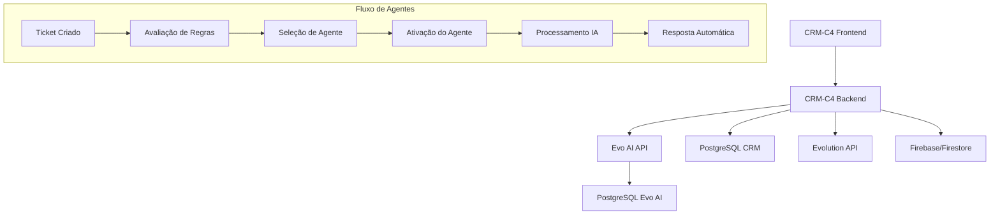

# Guia de Implementação: Sistema de Agentes IA com Evo AI no CRM-C4

## 1. Análise da Arquitetura do Evo AI

### 1.1 Visão Geral da Plataforma
O Evo AI é uma plataforma open-source para criação e gerenciamento de agentes IA que oferece:

- **Criação e gerenciamento de agentes IA**
- **Integração com diferentes modelos de linguagem** (GPT-4, Claude, etc.)
- **Gerenciamento de clientes e configuração de servidores MCP**
- **Gerenciamento de ferramentas customizadas**
- **Autenticação JWT com verificação de email**
- **Protocolo Agent 2 Agent (A2A)** para interoperabilidade
- **Workflows com LangGraph** para agentes complexos
- **Gerenciamento seguro de API Keys** com armazenamento criptografado

### 1.2 Tipos de Agentes Suportados

1. **LLM Agent (Language Model)**
   - Baseado em modelos de linguagem como GPT-4, Claude
   - Configurável com ferramentas, servidores MCP e sub-agentes

2. **A2A Agent (Agent-to-Agent)**
   - Implementa protocolo A2A do Google para interoperabilidade

3. **Sequential Agent**
   - Executa sequência de sub-agentes em ordem específica

4. **Parallel Agent**
   - Executa múltiplos sub-agentes simultaneamente

5. **Loop Agent**
   - Executa sub-agentes em loop com número máximo de iterações

6. **Workflow Agent**
   - Executa sub-agentes em workflow customizado usando LangGraph

7. **Task Agent**
   - Executa tarefa específica usando agente alvo com instruções estruturadas

### 1.3 Stack Tecnológico

**Backend:**
- FastAPI (Framework web)
- SQLAlchemy (ORM)
- PostgreSQL (Banco principal)
- Alembic (Sistema de migração)
- Redis (Cache e gerenciamento de sessão)
- JWT (Autenticação segura)
- LangGraph (Workflows de agentes)

**Frontend:**
- Next.js 15 com App Router
- React 18
- TypeScript
- Tailwind CSS
- shadcn/ui
- ReactFlow (Workflows visuais)

## 2. Integração com o Sistema de Tickets do CRM-C4

### 2.1 Arquitetura de Integração



### 2.2 Estrutura de Dados Estendida

#### 2.2.1 Extensão da Interface Ticket

```typescript
interface Ticket {
  // Campos existentes...
  id: string;
  remoteJid: string;
  instanceName: string;
  status: 'open' | 'pending' | 'in_progress' | 'resolved' | 'closed';
  priority: 'low' | 'medium' | 'high' | 'urgent';
  
  // Novos campos para agentes IA
  assignedAgent?: {
    type: 'human' | 'ai';
    id: string;
    name: string;
    evoAiAgentId?: string;
  };
  
  aiConfig?: {
    activationMode: 'immediate' | 'manual' | 'keyword' | 'scheduled';
    activationTrigger?: {
      keywords?: string[];
      delay?: number; // em minutos
      conditions?: AgentActivationCondition[];
    };
    autoResponse: boolean;
    escalationRules?: {
      maxInteractions: number;
      escalateToHuman: boolean;
      escalationConditions: string[];
    };
  };
  
  agentInteractions?: AgentInteraction[];
}

interface AgentInteraction {
  id: string;
  agentId: string;
  timestamp: Date;
  type: 'activation' | 'response' | 'escalation' | 'handoff';
  content?: string;
  confidence?: number;
  metadata?: Record<string, any>;
}

interface AgentActivationCondition {
  type: 'time' | 'message_count' | 'sentiment' | 'priority' | 'keyword';
  operator: 'equals' | 'contains' | 'greater_than' | 'less_than';
  value: string | number;
}
```

#### 2.2.2 Configuração de Agentes IA

```typescript
interface AIAgentConfig {
  id: string;
  name: string;
  description: string;
  evoAiAgentId: string;
  
  // Configurações de ativação
  activationRules: {
    priority: number; // 1-10, maior = mais prioritário
    conditions: AgentActivationCondition[];
    timeRestrictions?: {
      workingHours?: { start: string; end: string; };
      weekdays?: number[]; // 0-6, domingo = 0
      timezone?: string;
    };
  };
  
  // Configurações de comportamento
  behavior: {
    maxInteractionsPerTicket: number;
    autoEscalation: boolean;
    escalationThreshold: number; // confiança mínima
    responseDelay?: number; // simular digitação humana
  };
  
  // Configurações do modelo
  modelConfig: {
    temperature: number;
    maxTokens: number;
    systemPrompt: string;
    tools?: string[];
  };
  
  status: 'active' | 'inactive' | 'testing';
  createdAt: Date;
  updatedAt: Date;
}
```

## 3. Implementação de Seleção de Agentes por Ticket

### 3.1 Sistema de Regras de Ativação

```typescript
class AgentSelectionService {
  async selectAgentForTicket(ticket: Ticket): Promise<AIAgentConfig | null> {
    const availableAgents = await this.getActiveAgents();
    const ticketContext = await this.analyzeTicketContext(ticket);
    
    // Avaliar cada agente baseado nas regras
    const agentScores = await Promise.all(
      availableAgents.map(agent => this.scoreAgent(agent, ticketContext))
    );
    
    // Selecionar agente com maior pontuação
    const bestMatch = agentScores
      .filter(score => score.score > 0.5) // threshold mínimo
      .sort((a, b) => b.score - a.score)[0];
    
    return bestMatch?.agent || null;
  }
  
  private async scoreAgent(
    agent: AIAgentConfig, 
    context: TicketContext
  ): Promise<{ agent: AIAgentConfig; score: number }> {
    let score = 0;
    
    // Avaliar condições de ativação
    for (const condition of agent.activationRules.conditions) {
      if (this.evaluateCondition(condition, context)) {
        score += 0.2;
      }
    }
    
    // Considerar prioridade do agente
    score += (agent.activationRules.priority / 10) * 0.3;
    
    // Verificar restrições de tempo
    if (this.isWithinTimeRestrictions(agent.activationRules.timeRestrictions)) {
      score += 0.1;
    }
    
    // Verificar disponibilidade (não exceder max interactions)
    const currentInteractions = await this.getAgentCurrentInteractions(agent.id);
    if (currentInteractions < agent.behavior.maxInteractionsPerTicket) {
      score += 0.2;
    }
    
    return { agent, score: Math.min(score, 1.0) };
  }
}
```

### 3.2 Interface de Seleção Manual

```typescript
// Componente para seleção manual de agente
const AgentSelectionModal: React.FC<{
  ticket: Ticket;
  onAgentSelected: (agent: AIAgentConfig) => void;
}> = ({ ticket, onAgentSelected }) => {
  const [agents, setAgents] = useState<AIAgentConfig[]>([]);
  const [selectedAgent, setSelectedAgent] = useState<string>('');
  
  useEffect(() => {
    loadAvailableAgents();
  }, []);
  
  const loadAvailableAgents = async () => {
    const response = await fetch('/api/agents/available', {
      method: 'POST',
      headers: { 'Content-Type': 'application/json' },
      body: JSON.stringify({ ticketId: ticket.id })
    });
    const data = await response.json();
    setAgents(data.agents);
  };
  
  return (
    <Dialog>
      <DialogContent>
        <DialogHeader>
          <DialogTitle>Selecionar Agente IA</DialogTitle>
          <DialogDescription>
            Escolha um agente IA para atender este ticket
          </DialogDescription>
        </DialogHeader>
        
        <div className="space-y-4">
          {agents.map(agent => (
            <div key={agent.id} className="border rounded p-4">
              <div className="flex items-center space-x-2">
                <input
                  type="radio"
                  id={agent.id}
                  name="agent"
                  value={agent.id}
                  onChange={(e) => setSelectedAgent(e.target.value)}
                />
                <label htmlFor={agent.id} className="font-medium">
                  {agent.name}
                </label>
              </div>
              <p className="text-sm text-gray-600 mt-1">
                {agent.description}
              </p>
              <div className="flex items-center space-x-4 mt-2 text-xs text-gray-500">
                <span>Prioridade: {agent.activationRules.priority}</span>
                <span>Status: {agent.status}</span>
              </div>
            </div>
          ))}
        </div>
        
        <DialogFooter>
          <Button
            onClick={() => {
              const agent = agents.find(a => a.id === selectedAgent);
              if (agent) onAgentSelected(agent);
            }}
            disabled={!selectedAgent}
          >
            Atribuir Agente
          </Button>
        </DialogFooter>
      </DialogContent>
    </Dialog>
  );
};
```

## 4. Configuração de Ativação

### 4.1 Modos de Ativação

#### 4.1.1 Ativação Imediata
```typescript
class ImmediateActivationHandler {
  async handleNewTicket(ticket: Ticket): Promise<void> {
    const agent = await this.agentSelectionService.selectAgentForTicket(ticket);
    
    if (agent && agent.activationRules.conditions.some(c => c.type === 'immediate')) {
      await this.activateAgent(ticket, agent);
    }
  }
  
  private async activateAgent(ticket: Ticket, agent: AIAgentConfig): Promise<void> {
    // Atualizar ticket com agente atribuído
    await this.updateTicketAgent(ticket.id, agent);
    
    // Enviar primeira mensagem se configurado
    if (agent.behavior.autoResponse) {
      await this.sendInitialResponse(ticket, agent);
    }
  }
}
```

#### 4.1.2 Ativação por Palavra-chave
```typescript
class KeywordActivationHandler {
  async handleNewMessage(message: Message, ticket: Ticket): Promise<void> {
    const agents = await this.getAgentsWithKeywordTriggers();
    
    for (const agent of agents) {
      const keywords = agent.aiConfig?.activationTrigger?.keywords || [];
      
      if (this.messageContainsKeywords(message.content, keywords)) {
        await this.activateAgent(ticket, agent);
        break; // Ativar apenas o primeiro agente que corresponder
      }
    }
  }
  
  private messageContainsKeywords(content: string, keywords: string[]): boolean {
    const lowerContent = content.toLowerCase();
    return keywords.some(keyword => 
      lowerContent.includes(keyword.toLowerCase())
    );
  }
}
```

#### 4.1.3 Ativação Manual
```typescript
class ManualActivationHandler {
  async activateAgentManually(
    ticketId: string, 
    agentId: string, 
    userId: string
  ): Promise<void> {
    const ticket = await this.getTicket(ticketId);
    const agent = await this.getAgent(agentId);
    
    // Verificar permissões
    if (!await this.userCanActivateAgent(userId, agentId)) {
      throw new Error('Usuário não tem permissão para ativar este agente');
    }
    
    // Ativar agente
    await this.activateAgent(ticket, agent);
    
    // Registrar ação
    await this.logAgentActivation(ticketId, agentId, userId, 'manual');
  }
}
```

### 4.2 Interface de Configuração

```typescript
const AgentActivationConfig: React.FC<{
  agent: AIAgentConfig;
  onSave: (config: AIAgentConfig) => void;
}> = ({ agent, onSave }) => {
  const [activationMode, setActivationMode] = useState(agent.aiConfig?.activationMode || 'manual');
  const [keywords, setKeywords] = useState(agent.aiConfig?.activationTrigger?.keywords || []);
  const [delay, setDelay] = useState(agent.aiConfig?.activationTrigger?.delay || 0);
  
  return (
    <div className="space-y-6">
      <div>
        <Label>Modo de Ativação</Label>
        <Select value={activationMode} onValueChange={setActivationMode}>
          <SelectTrigger>
            <SelectValue />
          </SelectTrigger>
          <SelectContent>
            <SelectItem value="immediate">Imediato</SelectItem>
            <SelectItem value="manual">Manual</SelectItem>
            <SelectItem value="keyword">Por Palavra-chave</SelectItem>
            <SelectItem value="scheduled">Agendado</SelectItem>
          </SelectContent>
        </Select>
      </div>
      
      {activationMode === 'keyword' && (
        <div>
          <Label>Palavras-chave de Ativação</Label>
          <TagInput
            value={keywords}
            onChange={setKeywords}
            placeholder="Digite uma palavra-chave e pressione Enter"
          />
        </div>
      )}
      
      {activationMode === 'scheduled' && (
        <div>
          <Label>Delay de Ativação (minutos)</Label>
          <Input
            type="number"
            value={delay}
            onChange={(e) => setDelay(Number(e.target.value))}
            min={0}
          />
        </div>
      )}
      
      <Button onClick={() => {
        const updatedAgent = {
          ...agent,
          aiConfig: {
            ...agent.aiConfig,
            activationMode,
            activationTrigger: {
              keywords,
              delay
            }
          }
        };
        onSave(updatedAgent);
      }}>
        Salvar Configuração
      </Button>
    </div>
  );
};
```

## 5. Fluxo de Automação do Atendimento

### 5.1 Processamento de Mensagens

```typescript
class AIAttendanceFlow {
  async processIncomingMessage(message: Message, ticket: Ticket): Promise<void> {
    // 1. Verificar se há agente IA ativo no ticket
    if (!ticket.assignedAgent || ticket.assignedAgent.type !== 'ai') {
      return;
    }
    
    // 2. Obter configuração do agente
    const agentConfig = await this.getAgentConfig(ticket.assignedAgent.id);
    
    // 3. Verificar se deve responder automaticamente
    if (!agentConfig.behavior.autoResponse) {
      return;
    }
    
    // 4. Processar mensagem com IA
    const response = await this.processWithEvoAI(message, ticket, agentConfig);
    
    // 5. Verificar confiança da resposta
    if (response.confidence < agentConfig.behavior.escalationThreshold) {
      await this.escalateToHuman(ticket, response);
      return;
    }
    
    // 6. Enviar resposta
    await this.sendAIResponse(ticket, response, agentConfig);
    
    // 7. Registrar interação
    await this.logAgentInteraction(ticket.id, agentConfig.id, response);
  }
  
  private async processWithEvoAI(
    message: Message, 
    ticket: Ticket, 
    agentConfig: AIAgentConfig
  ): Promise<AIResponse> {
    const context = await this.buildContext(ticket);
    
    const response = await fetch(`${process.env.EVO_AI_URL}/api/agents/${agentConfig.evoAiAgentId}/process`, {
      method: 'POST',
      headers: {
        'Authorization': `Bearer ${process.env.EVO_AI_TOKEN}`,
        'Content-Type': 'application/json'
      },
      body: JSON.stringify({
        message: message.content,
        context,
        config: agentConfig.modelConfig
      })
    });
    
    return await response.json();
  }
  
  private async sendAIResponse(
    ticket: Ticket, 
    response: AIResponse, 
    agentConfig: AIAgentConfig
  ): Promise<void> {
    // Simular delay de digitação se configurado
    if (agentConfig.behavior.responseDelay) {
      await this.simulateTyping(ticket.remoteJid, agentConfig.behavior.responseDelay);
    }
    
    // Enviar mensagem via Evolution API
    await this.evolutionAPI.sendMessage({
      instanceName: ticket.instanceName,
      remoteJid: ticket.remoteJid,
      message: response.content,
      metadata: {
        agentId: agentConfig.id,
        confidence: response.confidence,
        automated: true
      }
    });
  }
}
```

### 5.2 Sistema de Escalação

```typescript
class EscalationService {
  async escalateToHuman(ticket: Ticket, reason: EscalationReason): Promise<void> {
    // 1. Atualizar status do ticket
    await this.updateTicketStatus(ticket.id, 'pending_human');
    
    // 2. Remover agente IA
    await this.removeAIAgent(ticket.id);
    
    // 3. Notificar agentes humanos disponíveis
    await this.notifyHumanAgents(ticket, reason);
    
    // 4. Registrar escalação
    await this.logEscalation(ticket.id, reason);
    
    // 5. Enviar mensagem de transição (opcional)
    if (reason.sendTransitionMessage) {
      await this.sendTransitionMessage(ticket);
    }
  }
  
  private async notifyHumanAgents(ticket: Ticket, reason: EscalationReason): Promise<void> {
    const availableAgents = await this.getAvailableHumanAgents();
    
    for (const agent of availableAgents) {
      await this.sendNotification(agent.id, {
        type: 'escalation',
        ticketId: ticket.id,
        reason: reason.type,
        priority: ticket.priority,
        message: `Ticket ${ticket.id} foi escalado: ${reason.description}`
      });
    }
  }
}
```

## 6. APIs Necessárias

### 6.1 API de Integração com Evo AI

```typescript
// /api/evo-ai/agents
export async function GET() {
  try {
    const response = await fetch(`${process.env.EVO_AI_URL}/api/agents`, {
      headers: {
        'Authorization': `Bearer ${process.env.EVO_AI_TOKEN}`
      }
    });
    
    const agents = await response.json();
    return NextResponse.json({ agents });
  } catch (error) {
    return NextResponse.json({ error: 'Failed to fetch agents' }, { status: 500 });
  }
}

// /api/evo-ai/agents/[id]/activate
export async function POST(request: Request, { params }: { params: { id: string } }) {
  try {
    const { ticketId, context } = await request.json();
    
    const response = await fetch(`${process.env.EVO_AI_URL}/api/agents/${params.id}/activate`, {
      method: 'POST',
      headers: {
        'Authorization': `Bearer ${process.env.EVO_AI_TOKEN}`,
        'Content-Type': 'application/json'
      },
      body: JSON.stringify({ ticketId, context })
    });
    
    const result = await response.json();
    return NextResponse.json(result);
  } catch (error) {
    return NextResponse.json({ error: 'Failed to activate agent' }, { status: 500 });
  }
}
```

### 6.2 API de Gerenciamento de Agentes no Ticket

```typescript
// /api/tickets/[id]/agent
export async function POST(request: Request, { params }: { params: { id: string } }) {
  try {
    const { agentId, activationMode } = await request.json();
    
    // Validar agente
    const agent = await getAIAgentConfig(agentId);
    if (!agent) {
      return NextResponse.json({ error: 'Agent not found' }, { status: 404 });
    }
    
    // Atualizar ticket
    await updateTicketAgent(params.id, {
      type: 'ai',
      id: agentId,
      name: agent.name,
      evoAiAgentId: agent.evoAiAgentId
    });
    
    // Ativar agente se necessário
    if (activationMode === 'immediate') {
      await activateAgentForTicket(params.id, agentId);
    }
    
    return NextResponse.json({ success: true });
  } catch (error) {
    return NextResponse.json({ error: 'Failed to assign agent' }, { status: 500 });
  }
}

// GET - Obter agente atual do ticket
export async function GET(request: Request, { params }: { params: { id: string } }) {
  try {
    const ticket = await getTicket(params.id);
    return NextResponse.json({ agent: ticket.assignedAgent });
  } catch (error) {
    return NextResponse.json({ error: 'Failed to get ticket agent' }, { status: 500 });
  }
}

// DELETE - Remover agente do ticket
export async function DELETE(request: Request, { params }: { params: { id: string } }) {
  try {
    await removeTicketAgent(params.id);
    return NextResponse.json({ success: true });
  } catch (error) {
    return NextResponse.json({ error: 'Failed to remove agent' }, { status: 500 });
  }
}
```

### 6.3 API de Configuração de Agentes

```typescript
// /api/agents/config
export async function GET() {
  try {
    const agents = await getAllAIAgentConfigs();
    return NextResponse.json({ agents });
  } catch (error) {
    return NextResponse.json({ error: 'Failed to fetch agent configs' }, { status: 500 });
  }
}

export async function POST(request: Request) {
  try {
    const config: AIAgentConfig = await request.json();
    
    // Validar configuração
    const validation = validateAgentConfig(config);
    if (!validation.valid) {
      return NextResponse.json({ error: validation.errors }, { status: 400 });
    }
    
    // Salvar configuração
    const savedConfig = await saveAIAgentConfig(config);
    
    return NextResponse.json({ config: savedConfig });
  } catch (error) {
    return NextResponse.json({ error: 'Failed to save agent config' }, { status: 500 });
  }
}

// /api/agents/config/[id]
export async function PUT(request: Request, { params }: { params: { id: string } }) {
  try {
    const updates = await request.json();
    const updatedConfig = await updateAIAgentConfig(params.id, updates);
    
    return NextResponse.json({ config: updatedConfig });
  } catch (error) {
    return NextResponse.json({ error: 'Failed to update agent config' }, { status: 500 });
  }
}
```

## 7. Interface do Usuário

### 7.1 Painel de Gerenciamento de Agentes no Ticket

```typescript
const TicketAgentPanel: React.FC<{ ticket: Ticket }> = ({ ticket }) => {
  const [assignedAgent, setAssignedAgent] = useState(ticket.assignedAgent);
  const [showAgentSelector, setShowAgentSelector] = useState(false);
  const [agentInteractions, setAgentInteractions] = useState<AgentInteraction[]>([]);
  
  useEffect(() => {
    if (assignedAgent?.type === 'ai') {
      loadAgentInteractions();
    }
  }, [assignedAgent]);
  
  const loadAgentInteractions = async () => {
    const response = await fetch(`/api/tickets/${ticket.id}/agent/interactions`);
    const data = await response.json();
    setAgentInteractions(data.interactions);
  };
  
  const handleAgentAssignment = async (agent: AIAgentConfig) => {
    try {
      await fetch(`/api/tickets/${ticket.id}/agent`, {
        method: 'POST',
        headers: { 'Content-Type': 'application/json' },
        body: JSON.stringify({ 
          agentId: agent.id,
          activationMode: 'immediate'
        })
      });
      
      setAssignedAgent({
        type: 'ai',
        id: agent.id,
        name: agent.name,
        evoAiAgentId: agent.evoAiAgentId
      });
      
      setShowAgentSelector(false);
    } catch (error) {
      console.error('Failed to assign agent:', error);
    }
  };
  
  const handleRemoveAgent = async () => {
    try {
      await fetch(`/api/tickets/${ticket.id}/agent`, {
        method: 'DELETE'
      });
      
      setAssignedAgent(undefined);
    } catch (error) {
      console.error('Failed to remove agent:', error);
    }
  };
  
  return (
    <Card>
      <CardHeader>
        <CardTitle className="flex items-center justify-between">
          <span>Agente Responsável</span>
          {!assignedAgent && (
            <Button 
              size="sm" 
              onClick={() => setShowAgentSelector(true)}
            >
              <Bot className="w-4 h-4 mr-2" />
              Atribuir Agente IA
            </Button>
          )}
        </CardTitle>
      </CardHeader>
      
      <CardContent>
        {assignedAgent ? (
          <div className="space-y-4">
            <div className="flex items-center justify-between">
              <div className="flex items-center space-x-3">
                {assignedAgent.type === 'ai' ? (
                  <Bot className="w-8 h-8 text-blue-500" />
                ) : (
                  <User className="w-8 h-8 text-green-500" />
                )}
                <div>
                  <p className="font-medium">{assignedAgent.name}</p>
                  <p className="text-sm text-gray-500">
                    {assignedAgent.type === 'ai' ? 'Agente IA' : 'Agente Humano'}
                  </p>
                </div>
              </div>
              
              <DropdownMenu>
                <DropdownMenuTrigger asChild>
                  <Button variant="ghost" size="sm">
                    <MoreVertical className="w-4 h-4" />
                  </Button>
                </DropdownMenuTrigger>
                <DropdownMenuContent>
                  <DropdownMenuItem onClick={handleRemoveAgent}>
                    Remover Agente
                  </DropdownMenuItem>
                  {assignedAgent.type === 'ai' && (
                    <DropdownMenuItem onClick={() => setShowAgentSelector(true)}>
                      Trocar Agente
                    </DropdownMenuItem>
                  )}
                </DropdownMenuContent>
              </DropdownMenu>
            </div>
            
            {assignedAgent.type === 'ai' && agentInteractions.length > 0 && (
              <div>
                <h4 className="font-medium mb-2">Interações do Agente</h4>
                <div className="space-y-2 max-h-40 overflow-y-auto">
                  {agentInteractions.map(interaction => (
                    <div key={interaction.id} className="text-sm border-l-2 border-blue-200 pl-3">
                      <div className="flex items-center justify-between">
                        <span className="font-medium">
                          {interaction.type === 'activation' && '🚀 Ativado'}
                          {interaction.type === 'response' && '💬 Resposta'}
                          {interaction.type === 'escalation' && '⬆️ Escalado'}
                        </span>
                        <span className="text-gray-500">
                          {new Date(interaction.timestamp).toLocaleTimeString()}
                        </span>
                      </div>
                      {interaction.confidence && (
                        <div className="text-xs text-gray-500">
                          Confiança: {(interaction.confidence * 100).toFixed(1)}%
                        </div>
                      )}
                    </div>
                  ))}
                </div>
              </div>
            )}
          </div>
        ) : (
          <div className="text-center py-8 text-gray-500">
            <Bot className="w-12 h-12 mx-auto mb-3 opacity-50" />
            <p>Nenhum agente atribuído</p>
            <p className="text-sm">Clique em "Atribuir Agente IA" para começar</p>
          </div>
        )}
      </CardContent>
      
      {showAgentSelector && (
        <AgentSelectionModal
          ticket={ticket}
          onAgentSelected={handleAgentAssignment}
          onClose={() => setShowAgentSelector(false)}
        />
      )}
    </Card>
  );
};
```

### 7.2 Dashboard de Monitoramento de Agentes

```typescript
const AgentMonitoringDashboard: React.FC = () => {
  const [agents, setAgents] = useState<AIAgentConfig[]>([]);
  const [metrics, setMetrics] = useState<AgentMetrics[]>([]);
  const [timeframe, setTimeframe] = useState<'24h' | '7d' | '30d'>('24h');
  
  useEffect(() => {
    loadAgents();
    loadMetrics();
  }, [timeframe]);
  
  const loadAgents = async () => {
    const response = await fetch('/api/agents/config');
    const data = await response.json();
    setAgents(data.agents);
  };
  
  const loadMetrics = async () => {
    const response = await fetch(`/api/agents/metrics?timeframe=${timeframe}`);
    const data = await response.json();
    setMetrics(data.metrics);
  };
  
  return (
    <div className="space-y-6">
      <div className="flex items-center justify-between">
        <h1 className="text-2xl font-bold">Monitoramento de Agentes IA</h1>
        <Select value={timeframe} onValueChange={setTimeframe}>
          <SelectTrigger className="w-32">
            <SelectValue />
          </SelectTrigger>
          <SelectContent>
            <SelectItem value="24h">24 horas</SelectItem>
            <SelectItem value="7d">7 dias</SelectItem>
            <SelectItem value="30d">30 dias</SelectItem>
          </SelectContent>
        </Select>
      </div>
      
      {/* Cards de métricas gerais */}
      <div className="grid grid-cols-1 md:grid-cols-4 gap-4">
        <Card>
          <CardContent className="p-6">
            <div className="flex items-center">
              <Bot className="h-8 w-8 text-blue-500" />
              <div className="ml-4">
                <p className="text-sm font-medium text-gray-500">Agentes Ativos</p>
                <p className="text-2xl font-bold">
                  {agents.filter(a => a.status === 'active').length}
                </p>
              </div>
            </div>
          </CardContent>
        </Card>
        
        <Card>
          <CardContent className="p-6">
            <div className="flex items-center">
              <MessageSquare className="h-8 w-8 text-green-500" />
              <div className="ml-4">
                <p className="text-sm font-medium text-gray-500">Interações</p>
                <p className="text-2xl font-bold">
                  {metrics.reduce((sum, m) => sum + m.totalInteractions, 0)}
                </p>
              </div>
            </div>
          </CardContent>
        </Card>
        
        <Card>
          <CardContent className="p-6">
            <div className="flex items-center">
              <TrendingUp className="h-8 w-8 text-orange-500" />
              <div className="ml-4">
                <p className="text-sm font-medium text-gray-500">Taxa de Sucesso</p>
                <p className="text-2xl font-bold">
                  {metrics.length > 0 ? 
                    Math.round(
                      metrics.reduce((sum, m) => sum + m.successRate, 0) / metrics.length
                    ) : 0
                  }%
                </p>
              </div>
            </div>
          </CardContent>
        </Card>
        
        <Card>
          <CardContent className="p-6">
            <div className="flex items-center">
              <AlertTriangle className="h-8 w-8 text-red-500" />
              <div className="ml-4">
                <p className="text-sm font-medium text-gray-500">Escalações</p>
                <p className="text-2xl font-bold">
                  {metrics.reduce((sum, m) => sum + m.escalations, 0)}
                </p>
              </div>
            </div>
          </CardContent>
        </Card>
      </div>
      
      {/* Tabela de agentes */}
      <Card>
        <CardHeader>
          <CardTitle>Performance dos Agentes</CardTitle>
        </CardHeader>
        <CardContent>
          <Table>
            <TableHeader>
              <TableRow>
                <TableHead>Agente</TableHead>
                <TableHead>Status</TableHead>
                <TableHead>Interações</TableHead>
                <TableHead>Taxa de Sucesso</TableHead>
                <TableHead>Escalações</TableHead>
                <TableHead>Última Atividade</TableHead>
                <TableHead>Ações</TableHead>
              </TableRow>
            </TableHeader>
            <TableBody>
              {agents.map(agent => {
                const metric = metrics.find(m => m.agentId === agent.id);
                return (
                  <TableRow key={agent.id}>
                    <TableCell>
                      <div className="flex items-center space-x-2">
                        <Bot className="w-4 h-4" />
                        <span className="font-medium">{agent.name}</span>
                      </div>
                    </TableCell>
                    <TableCell>
                      <Badge 
                        variant={agent.status === 'active' ? 'default' : 'secondary'}
                      >
                        {agent.status}
                      </Badge>
                    </TableCell>
                    <TableCell>{metric?.totalInteractions || 0}</TableCell>
                    <TableCell>{metric?.successRate || 0}%</TableCell>
                    <TableCell>{metric?.escalations || 0}</TableCell>
                    <TableCell>
                      {metric?.lastActivity ? 
                        new Date(metric.lastActivity).toLocaleString() : 
                        'Nunca'
                      }
                    </TableCell>
                    <TableCell>
                      <DropdownMenu>
                        <DropdownMenuTrigger asChild>
                          <Button variant="ghost" size="sm">
                            <MoreVertical className="w-4 h-4" />
                          </Button>
                        </DropdownMenuTrigger>
                        <DropdownMenuContent>
                          <DropdownMenuItem>
                            Ver Detalhes
                          </DropdownMenuItem>
                          <DropdownMenuItem>
                            Editar Configuração
                          </DropdownMenuItem>
                          <DropdownMenuItem>
                            {agent.status === 'active' ? 'Desativar' : 'Ativar'}
                          </DropdownMenuItem>
                        </DropdownMenuContent>
                      </DropdownMenu>
                    </TableCell>
                  </TableRow>
                );
              })}
            </TableBody>
          </Table>
        </CardContent>
      </Card>
    </div>
  );
};
```

## 8. Considerações de Implementação

### 8.1 Segurança
- **Autenticação**: Todas as chamadas para Evo AI devem usar JWT tokens
- **Autorização**: Verificar permissões antes de ativar/desativar agentes
- **Rate Limiting**: Implementar limites para evitar spam de ativações
- **Logs de Auditoria**: Registrar todas as ações relacionadas a agentes

### 8.2 Performance
- **Cache**: Cachear configurações de agentes frequentemente usadas
- **Async Processing**: Processar ativações de agentes de forma assíncrona
- **Connection Pooling**: Usar pool de conexões para Evo AI
- **Monitoring**: Implementar métricas de performance

### 8.3 Escalabilidade
- **Queue System**: Usar filas para processar ativações em lote
- **Load Balancing**: Distribuir carga entre múltiplas instâncias do Evo AI
- **Database Optimization**: Indexar campos frequentemente consultados
- **Horizontal Scaling**: Preparar para múltiplas instâncias do CRM

### 8.4 Monitoramento
- **Health Checks**: Verificar saúde da conexão com Evo AI
- **Metrics Collection**: Coletar métricas de uso e performance
- **Alerting**: Alertas para falhas ou degradação de performance
- **Logging**: Logs estruturados para debugging

## 9. Próximos Passos

1. **Fase 1**: Implementar integração básica com Evo AI
2. **Fase 2**: Desenvolver sistema de seleção e ativação de agentes
3. **Fase 3**: Criar interfaces de usuário para gerenciamento
4. **Fase 4**: Implementar sistema de monitoramento e métricas
5. **Fase 5**: Otimizar performance e adicionar recursos avançados

Este guia fornece uma base sólida para implementar um sistema completo de agentes IA integrado ao CRM-C4, aproveitando as capacidades do Evo AI para automatizar e melhorar o atendimento ao cliente.