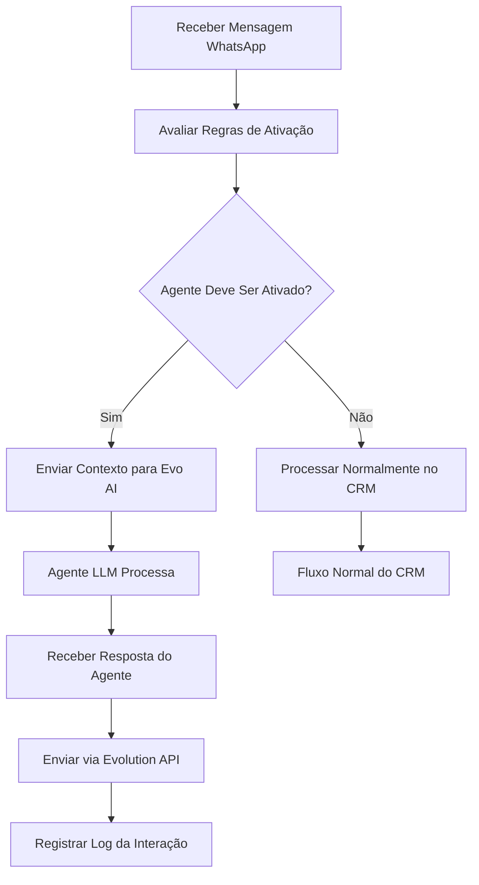

# Integração CRM WhatsApp com Evo AI - Documentação de Requisitos

## 1. Visão Geral do Projeto

Este documento especifica a integração entre o CRM WhatsApp existente e a plataforma Evo AI para criação e gerenciamento de agentes LLM inteligentes. A integração permitirá que usuários criem, configurem e gerenciem agentes de IA diretamente através da interface do CRM, com ativação automática baseada em regras configuráveis.

- **Objetivo Principal**: Automatizar atendimento no WhatsApp através de agentes LLM configuráveis
- **Plataforma Base**: Evo AI (https://github.com/EvolutionAPI/evo-ai) - plataforma open-source para criação e gerenciamento de agentes IA
- **Valor de Mercado**: Redução de 60-80% no tempo de resposta inicial e melhoria na qualidade do atendimento 24/7

## 2. Funcionalidades Principais

### 2.1 Papéis de Usuário

| Papel | Método de Registro | Permissões Principais |
|-------|-------------------|----------------------|
| Administrador | Acesso direto ao sistema | Criar/editar/excluir agentes, configurar regras globais, visualizar métricas |
| Operador | Convite do administrador | Ativar/desativar agentes por instância, visualizar logs, configurar prompts básicos |
| Visualizador | Convite do operador | Apenas visualizar métricas e logs dos agentes |

### 2.2 Módulos Funcionais

Nossa integração consiste nas seguintes páginas principais:

1. **Painel de Agentes**: listagem, criação e edição de agentes LLM
2. **Configuração de Regras**: definição de quando agentes devem ser ativados
3. **Gerenciamento de Prompts**: editor de prompts e configuração de modelos IA
4. **Métricas e Logs**: dashboard de performance e histórico de interações
5. **Configurações de Instância**: ativação/desativação por instância WhatsApp

### 2.3 Detalhes das Páginas

| Nome da Página | Nome do Módulo | Descrição da Funcionalidade |
|----------------|----------------|-----------------------------|
| Painel de Agentes | Lista de Agentes | Exibir todos os agentes criados, status, última atividade e ações rápidas |
| Painel de Agentes | Criação de Agente | Formulário para criar novo agente com nome, descrição, modelo IA e configurações básicas |
| Painel de Agentes | Edição de Agente | Modificar configurações do agente, prompts, ferramentas e parâmetros avançados |
| Configuração de Regras | Editor de Regras | Definir condições para ativação automática (horário, tipo mensagem, palavras-chave, prioridade ticket) |
| Configuração de Regras | Teste de Regras | Simular cenários para validar regras antes da ativação |
| Gerenciamento de Prompts | Editor de Prompts | Interface para criar e editar prompts com preview em tempo real |
| Gerenciamento de Prompts | Biblioteca de Templates | Prompts pré-definidos para diferentes cenários (vendas, suporte, FAQ) |
| Métricas e Logs | Dashboard de Performance | Gráficos de tempo resposta, taxa sucesso, interações por agente |
| Métricas e Logs | Histórico de Conversas | Log detalhado das interações dos agentes com clientes |
| Configurações de Instância | Gerenciamento por Instância | Ativar/desativar agentes específicos por instância WhatsApp |

## 3. Fluxo Principal de Processos

### Fluxo do Administrador
1. Acessa o painel de agentes
2. Cria novo agente definindo nome, modelo IA e prompt inicial
3. Configura regras de ativação (horários, condições, prioridades)
4. Testa o agente em ambiente de simulação
5. Ativa o agente para instâncias específicas
6. Monitora performance através das métricas

### Fluxo do Operador
1. Visualiza agentes disponíveis para sua instância
2. Ativa/desativa agentes conforme necessidade
3. Ajusta prompts básicos para contexto específico
4. Monitora logs de interações em tempo real

### Fluxo Automático do Sistema
1. Recebe mensagem via webhook Evolution API
2. Avalia regras configuradas para determinar ativação de agente
3. Se ativado, envia contexto para Evo AI
4. Processa resposta do agente LLM
5. Envia resposta via Evolution API
6. Registra interação nos logs

## 4. Design da Interface do Usuário

### 4.1 Estilo de Design

- **Cores Primárias**: #10B981 (verde principal), #059669 (verde escuro)
- **Cores Secundárias**: #F3F4F6 (cinza claro), #374151 (cinza escuro)
- **Estilo de Botões**: Arredondados com sombra sutil, efeito hover suave
- **Fontes**: Inter (títulos), system-ui (corpo), tamanhos 14px-24px
- **Layout**: Card-based com navegação lateral, design responsivo mobile-first
- **Ícones**: Lucide React com estilo outline, cores consistentes com tema

### 4.2 Visão Geral do Design das Páginas

| Nome da Página | Nome do Módulo | Elementos da UI |
|----------------|----------------|----------------|
| Painel de Agentes | Lista de Agentes | Cards com avatar do agente, status badge (ativo/inativo), métricas resumidas, botões de ação |
| Painel de Agentes | Criação de Agente | Modal com formulário em steps: Info Básica → Configuração IA → Prompts → Regras |
| Configuração de Regras | Editor de Regras | Interface drag-and-drop para condições, preview em tempo real, toggle switches |
| Gerenciamento de Prompts | Editor de Prompts | Split view com editor de código à esquerda e preview à direita, syntax highlighting |
| Métricas e Logs | Dashboard | Gráficos Chart.js, tabelas com paginação, filtros por data/agente, export CSV |
| Configurações de Instância | Gerenciamento | Lista de instâncias com toggle switches, indicadores de status, configurações por instância |

### 4.3 Responsividade

Design mobile-first com breakpoints:
- Mobile: 320px-768px (stack vertical, menu hambúrguer)
- Tablet: 768px-1024px (sidebar colapsável)
- Desktop: 1024px+ (sidebar fixa, layout em grid)

Otimização para touch em dispositivos móveis com botões mínimo 44px e espaçamento adequado.