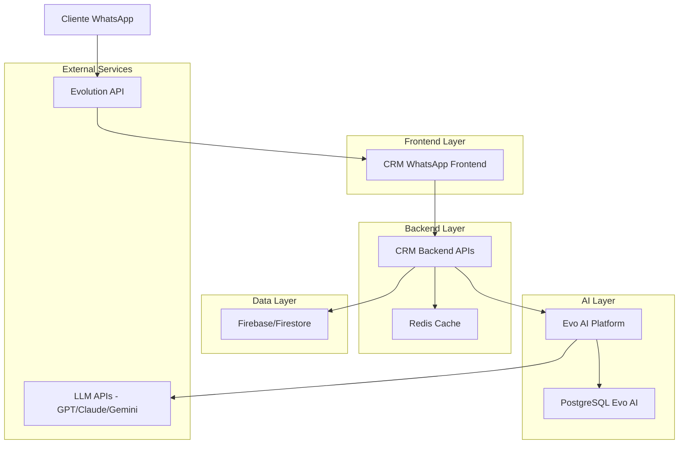
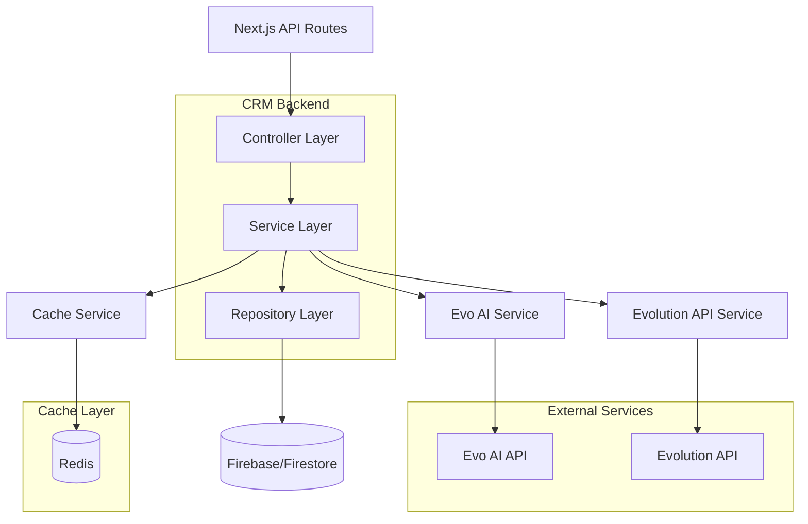
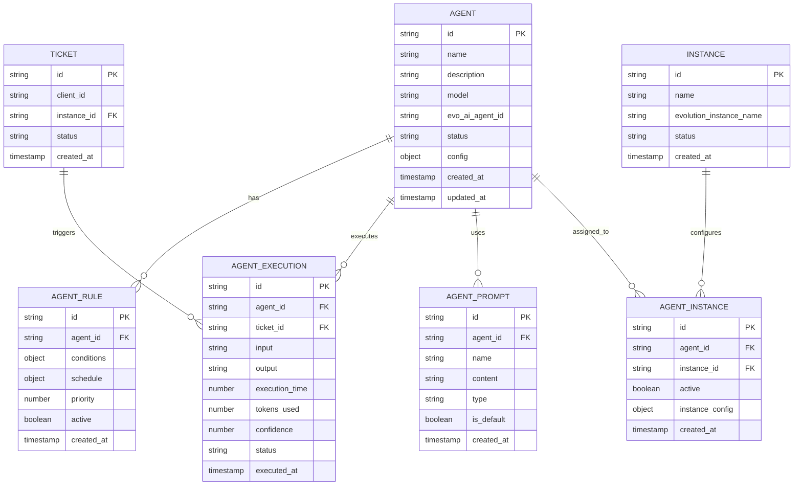

# Arquitetura Técnica - Integração CRM WhatsApp com Evo AI

## 1. Arquitetura do Sistema



## 2. Descrição das Tecnologias

- **Frontend**: React@18 + Next.js@14 + TypeScript + Tailwind CSS + shadcn/ui
- **Backend**: Next.js API Routes + Node.js@18
- **Database Principal**: Firebase/Firestore (dados do CRM)
- **Database Evo AI**: PostgreSQL (gerenciado pelo Evo AI)
- **Cache**: Redis (sessões e cache de respostas)
- **AI Platform**: Evo AI (FastAPI + SQLAlchemy + LangGraph)
- **Comunicação**: REST APIs + WebSockets (tempo real)

## 3. Definições de Rotas

| Rota | Propósito |
|------|----------|
| /agentes | Página principal de gerenciamento de agentes LLM |
| /agentes/criar | Formulário de criação de novo agente |
| /agentes/[id] | Página de edição e configuração de agente específico |
| /agentes/regras | Configuração de regras de ativação automática |
| /agentes/prompts | Gerenciamento de prompts e templates |
| /agentes/metricas | Dashboard de métricas e performance |
| /agentes/logs | Histórico detalhado de interações |
| /instancias/agentes | Configuração de agentes por instância WhatsApp |

## 4. Definições de APIs

### 4.1 APIs Principais do CRM

**Gerenciamento de Agentes**
```
GET /api/agents
```
Response:
| Campo | Tipo | Descrição |
|-------|------|----------|
| agents | Agent[] | Lista de agentes configurados |
| total | number | Total de agentes |

```
POST /api/agents
```
Request:
| Campo | Tipo | Obrigatório | Descrição |
|-------|------|-------------|----------|
| name | string | true | Nome do agente |
| description | string | false | Descrição do agente |
| model | string | true | Modelo LLM (gpt-4, claude-3, gemini-pro) |
| prompt | string | true | Prompt principal do agente |
| tools | string[] | false | Ferramentas disponíveis |
| rules | ActivationRule[] | false | Regras de ativação |

**Configuração de Regras**
```
POST /api/agents/{agentId}/rules
```
Request:
| Campo | Tipo | Obrigatório | Descrição |
|-------|------|-------------|----------|
| conditions | Condition[] | true | Condições para ativação |
| schedule | Schedule | false | Horários de funcionamento |
| priority | number | true | Prioridade da regra (1-10) |
| instances | string[] | false | Instâncias WhatsApp aplicáveis |

**Métricas e Logs**
```
GET /api/agents/{agentId}/metrics
```
Query Parameters:
| Campo | Tipo | Descrição |
|-------|------|----------|
| startDate | string | Data início (ISO 8601) |
| endDate | string | Data fim (ISO 8601) |
| instanceId | string | Filtrar por instância |

Response:
| Campo | Tipo | Descrição |
|-------|------|----------|
| totalInteractions | number | Total de interações |
| averageResponseTime | number | Tempo médio de resposta (ms) |
| successRate | number | Taxa de sucesso (0-100) |
| topTopics | string[] | Tópicos mais frequentes |

### 4.2 APIs de Integração com Evo AI

**Criação de Agente no Evo AI**
```
POST /api/evo-ai/agents
```
Request:
| Campo | Tipo | Obrigatório | Descrição |
|-------|------|-------------|----------|
| name | string | true | Nome do agente |
| type | string | true | Tipo: 'llm', 'workflow', 'sequential' |
| config | AgentConfig | true | Configuração específica do agente |
| tools | Tool[] | false | Ferramentas personalizadas |

**Execução de Agente**
```
POST /api/evo-ai/agents/{agentId}/execute
```
Request:
| Campo | Tipo | Obrigatório | Descrição |
|-------|------|-------------|----------|
| input | string | true | Mensagem do usuário |
| context | ConversationContext | true | Contexto da conversa |
| metadata | object | false | Metadados adicionais |

Response:
| Campo | Tipo | Descrição |
|-------|------|----------|
| response | string | Resposta gerada pelo agente |
| confidence | number | Confiança na resposta (0-1) |
| executionTime | number | Tempo de execução (ms) |
| tokensUsed | number | Tokens consumidos |

## 5. Arquitetura do Servidor



## 6. Modelo de Dados

### 6.1 Definição do Modelo de Dados



### 6.2 Definições de Linguagem de Dados (DDL)

**Tabela de Agentes (agents)**
```sql
-- Firestore Collection: agents
-- Document Structure:
{
  "id": "agent_uuid",
  "name": "Agente de Vendas",
  "description": "Agente especializado em vendas e conversão",
  "model": "gpt-4",
  "evoAiAgentId": "evo_agent_123",
  "status": "active", // active, inactive, error
  "config": {
    "temperature": 0.7,
    "maxTokens": 1000,
    "tools": ["web_search", "calculator"]
  },
  "createdAt": "2024-01-15T10:30:00Z",
  "updatedAt": "2024-01-15T10:30:00Z"
}

-- Índices necessários
CREATE INDEX idx_agents_status ON agents(status);
CREATE INDEX idx_agents_created_at ON agents(createdAt DESC);
```

**Tabela de Regras de Agentes (agent_rules)**
```sql
-- Firestore Collection: agent_rules
-- Document Structure:
{
  "id": "rule_uuid",
  "agentId": "agent_uuid",
  "conditions": {
    "messageTypes": ["text", "image"],
    "keywords": ["preço", "comprar", "produto"],
    "timeRange": {
      "start": "09:00",
      "end": "18:00"
    },
    "ticketPriority": ["high", "urgent"]
  },
  "schedule": {
    "timezone": "America/Sao_Paulo",
    "weekdays": [1, 2, 3, 4, 5], // Monday to Friday
    "holidays": false
  },
  "priority": 5,
  "active": true,
  "instances": ["instance_1", "instance_2"],
  "createdAt": "2024-01-15T10:30:00Z"
}

-- Índices necessários
CREATE INDEX idx_agent_rules_agent_id ON agent_rules(agentId);
CREATE INDEX idx_agent_rules_active ON agent_rules(active);
CREATE INDEX idx_agent_rules_priority ON agent_rules(priority DESC);
```

**Tabela de Execuções de Agentes (agent_executions)**
```sql
-- Firestore Collection: agent_executions
-- Document Structure:
{
  "id": "execution_uuid",
  "agentId": "agent_uuid",
  "ticketId": "ticket_uuid",
  "instanceId": "instance_uuid",
  "input": "Cliente perguntou sobre preços",
  "output": "Resposta gerada pelo agente",
  "executionTime": 1500, // milliseconds
  "tokensUsed": 150,
  "confidence": 0.85,
  "status": "success", // success, error, timeout
  "metadata": {
    "model": "gpt-4",
    "temperature": 0.7,
    "ruleId": "rule_uuid"
  },
  "executedAt": "2024-01-15T10:30:00Z"
}

-- Índices necessários
CREATE INDEX idx_executions_agent_id ON agent_executions(agentId);
CREATE INDEX idx_executions_executed_at ON agent_executions(executedAt DESC);
CREATE INDEX idx_executions_status ON agent_executions(status);
CREATE INDEX idx_executions_ticket_id ON agent_executions(ticketId);
```

**Dados Iniciais**
```sql
-- Agente padrão de exemplo
INSERT INTO agents (id, name, description, model, status, config) VALUES (
  'default_sales_agent',
  'Agente de Vendas Padrão',
  'Agente especializado em atendimento comercial e vendas',
  'gpt-4',
  'active',
  '{
    "temperature": 0.7,
    "maxTokens": 1000,
    "tools": ["product_catalog", "price_calculator"]
  }'
);

-- Regra padrão para horário comercial
INSERT INTO agent_rules (id, agent_id, conditions, priority, active) VALUES (
  'default_business_hours',
  'default_sales_agent',
  '{
    "timeRange": {"start": "09:00", "end": "18:00"},
    "weekdays": [1, 2, 3, 4, 5],
    "keywords": ["preço", "comprar", "produto", "vendas"]
  }',
  5,
  true
);
```