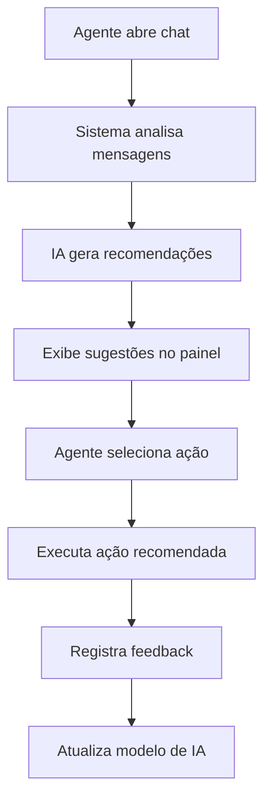

# Documento de Requisitos do Produto - Análise Inteligente de Mensagens

## 1. Visão Geral do Produto

Funcionalidade de análise inteligente que utiliza IA (Gemini) para analisar conversas de atendimento e gerar recomendações automáticas de próximas ações, melhorando a eficiência e assertividade da equipe de vendas e suporte.

* **Problema a resolver**: Agentes de atendimento frequentemente precisam analisar manualmente longas conversas para decidir a melhor próxima ação, resultando em perda de tempo e oportunidades.

* **Público-alvo**: Equipes de vendas, suporte e atendimento ao cliente que utilizam o sistema CRM.

* **Valor do produto**: Aumentar a conversão de leads em 25% e reduzir o tempo de análise de conversas em 80%.

## 2. Funcionalidades Principais

### 2.1 Papéis de Usuário

| Papel                 | Método de Acesso               | Permissões Principais                              |
| --------------------- | ------------------------------ | -------------------------------------------------- |
| Agente de Atendimento | Login no sistema CRM           | Visualizar recomendações, executar ações sugeridas |
| Supervisor            | Login com privilégios elevados | Visualizar métricas de IA, configurar parâmetros   |
| Administrador         | Acesso administrativo          | Configurar integração Gemini, gerenciar sistema    |

### 2.2 Módulos Funcionais

Nossa solução de análise inteligente consiste nas seguintes páginas principais:

1. **Painel de Chat**: interface principal onde as recomendações são exibidas em tempo real.
2. **Dashboard de IA**: métricas e insights sobre performance das recomendações.
3. **Configurações de IA**: ajustes de parâmetros e personalização do sistema.

### 2.3 Detalhes das Páginas

| Nome da Página      | Nome do Módulo          | Descrição da Funcionalidade                                                                                                                |
| ------------------- | ----------------------- | ------------------------------------------------------------------------------------------------------------------------------------------ |
| Painel de Chat      | Widget de Recomendações | Exibir análise automática da conversa, mostrar recomendações de ação com níveis de confiança, permitir execução direta das ações sugeridas |
| Painel de Chat      | Indicadores de Contexto | Mostrar estágio da conversa, sentimento do cliente, nível de urgência, tópicos principais identificados                                    |
| Painel de Chat      | Histórico de Análises   | Registrar análises anteriores, permitir comparação temporal, exibir evolução do relacionamento                                             |
| Dashboard de IA     | Métricas de Performance | Exibir taxa de acerto das recomendações, tempo médio de análise, impacto nas conversões                                                    |
| Dashboard de IA     | Relatórios de Uso       | Mostrar frequência de uso por agente, ações mais recomendadas, feedback dos usuários                                                       |
| Configurações de IA | Parâmetros do Modelo    | Ajustar sensibilidade da análise, configurar tipos de recomendação, definir critérios de urgência                                          |

## 3. Fluxo Principal de Uso

### Fluxo do Agente de Atendimento

1. **Abertura do Chat**: Agente acessa conversa com cliente
2. **Análise Automática**: Sistema analisa últimas 20 mensagens automaticamente
3. **Visualização de Recomendações**: Agente visualiza sugestões de ação no painel lateral
4. **Execução de Ação**: Agente clica na recomendação desejada (ligar, enviar proposta, agendar demo)
5. **Feedback**: Sistema registra ação executada para aprendizado

### Fluxo do Supervisor

1. **Acesso ao Dashboard**: Supervisor visualiza métricas gerais de performance
2. **Análise de Resultados**: Avalia eficácia das recomendações por agente/período
3. **Ajustes de Configuração**: Modifica parâmetros conforme necessário
4. **Relatórios**: Gera relatórios de impacto e ROI

## 4. Design da Interface do Usuário

### 4.1 Estilo de Design

* **Cores primárias**: Azul (#3B82F6) para elementos de IA, Verde (#10B981) para ações positivas

* **Cores secundárias**: Cinza (#6B7280) para textos auxiliares, Amarelo (#F59E0B) para alertas

* **Estilo de botões**: Arredondados com sombras sutis, estados hover com animações suaves

* **Tipografia**: Inter 14px para textos principais, 12px para metadados, 16px para títulos

* **Layout**: Cards com bordas arredondadas, espaçamento de 16px entre elementos

* **Ícones**: Lucide React com estilo outline, tamanho 16px para ações, 20px para títulos

### 4.2 Visão Geral do Design das Páginas

| Nome da Página      | Nome do Módulo          | Elementos de UI                                                                                                                                            |
| ------------------- | ----------------------- | ---------------------------------------------------------------------------------------------------------------------------------------------------------- |
| Painel de Chat      | Widget de Recomendações | Card flutuante no lado direito, ícone de cérebro (Brain), badges de confiança coloridos, botões de ação com ícones específicos (Phone, FileText, Calendar) |
| Painel de Chat      | Indicadores de Contexto | Badges coloridos para sentimento (verde/amarelo/vermelho), barra de progresso para estágio da conversa, chips para tópicos principais                      |
| Dashboard de IA     | Métricas de Performance | Gráficos de linha para tendências, cards de KPI com ícones, tabelas responsivas com filtros                                                                |
| Configurações de IA | Parâmetros do Modelo    | Sliders para ajustes numéricos, toggles para opções booleanas, dropdowns para seleções múltiplas                                                           |

### 4.3 Responsividade

O produto é desktop-first com adaptação mobile. Em dispositivos móveis, o widget de recomendações se torna um modal deslizante na parte inferior da tela, mantendo todas as funcionalidades principais acessíveis através de gestos touch otimizados.

## 5. Critérios de Aceitação

### 5.1 Funcionalidades Obrigatórias

* ✅ Análise automática das últimas 20 mensagens

* ✅ Geração de até 3 recomendações por conversa

* ✅ Exibição de nível de confiança (0-100%)

* ✅ Integração com ações do sistema (ligar, proposta, agenda)

* ✅ Tempo de resposta inferior a 3 segundos

* ✅ Interface responsiva para desktop e mobile

### 5.2 Métricas de Sucesso

* **Performance**: 95% das análises completadas em menos de 3 segundos

* **Precisão**: 80% de taxa de aceitação das recomendações pelos agentes

* **Adoção**: 90% dos agentes utilizando a funcionalidade regularmente

* **Impacto**: 25% de aumento na conversão de leads

* **Eficiência**: 80% de redução no tempo de análise manual

### 5.3 Requisitos Técnicos

* Integração com API do Google Gemini

* Compatibilidade com navegadores modernos (Chrome 90+, Firefox 88+, Safari 14+)

* Suporte a temas claro e escuro

* Acessibilidade WCAG 2.1 AA

* Logs de auditoria para todas as análises

## 6. Casos de Uso Detalhados

### 6.1 Caso de Uso: Cliente Interessado em Produto

**Cenário**: Cliente demonstra interesse em produto específico através de múltiplas perguntas

**Análise Esperada**:

* Estágio: "needs\_assessment"

* Sentimento: "positive"

* Urgência: "medium"

* Recomendação: "demo" - Agendar demonstração do produto

### 6.2 Caso de Uso: Cliente com Objeção de Preço

**Cenário**: Cliente questiona valores e compara com concorrentes

**Análise Esperada**:

* Estágio: "negotiation"

* Sentimento: "neutral"

* Urgência: "high"

* Recomendação: "call" - Ligar para negociar condições

### 6.3 Caso de Uso: Cliente Pronto para Fechar

**Cenário**: Cliente confirma interesse e solicita proposta formal

**Análise Esperada**:

* Estágio: "closing"

* Sentimento: "positive"

* Urgência: "high"

* Recomendação: "proposal" - Enviar proposta comercial

## 7. Limitações e Restrições

### 7.1 Limitações Técnicas

* Análise limitada a conversas em português

* Máximo de 20 mensagens por análise

* Dependência da disponibilidade da API do Gemini

* Requer conexão com internet estável

### 7.2 Limitações de Negócio

* Custo por análise baseado no uso da API

* Necessidade de treinamento da equipe

* Período de adaptação para calibração do modelo

* Compliance com LGPD para dados de clientes

## 8. Roadmap de Desenvolvimento

### 8.1 Fase 1 - MVP (4 semanas)

* Integração básica com Gemini

* Widget de recomendações no ChatPanel

* 3 tipos de ação (ligar, proposta, demo)

* Análise de sentimento básica

### 8.2 Fase 2 - Melhorias (6 semanas)

* Dashboard de métricas

* Histórico de análises

* Configurações personalizáveis

* Feedback loop para aprendizado

### 8.3 Fase 3 - Avançado (8 semanas)

* Análise preditiva de churn

* Recomendações personalizadas por agente

* Integração com histórico completo do cliente

* API para integrações externas

## 9. Considerações de Segurança e Privacidade

### 9.1 Proteção de Dados

* Dados de mensagens não são armazenados permanentemente

* Criptografia em trânsito para comunicação com Gemini

* Anonimização de dados sensíveis antes da análise

* Logs de auditoria com retenção de 90 dias

### 9.2 Compliance

* Conformidade com LGPD

* Política de privacidade atualizada

* Consentimento explícito para análise de IA

* Direito de opt-out para clientes

## 10. Plano de Testes

### 10.1 Testes Funcionais

* Análise de diferentes tipos de conversa

* Validação de recomendações geradas

* Teste de integração com ações do sistema

* Verificação de performance e tempo de resposta

### 10.2 Testes de Usabilidade

* Teste com agentes reais em ambiente controlado

* Avaliação da interface e fluxo de uso

* Feedback sobre clareza das recomendações

* Teste de acessibilidade

### 10.3 Testes de Carga

* Simulação de múltiplas análises simultâneas

* Teste de limite da API do Gemini

* Verificação de degradação graceful

* Mon

