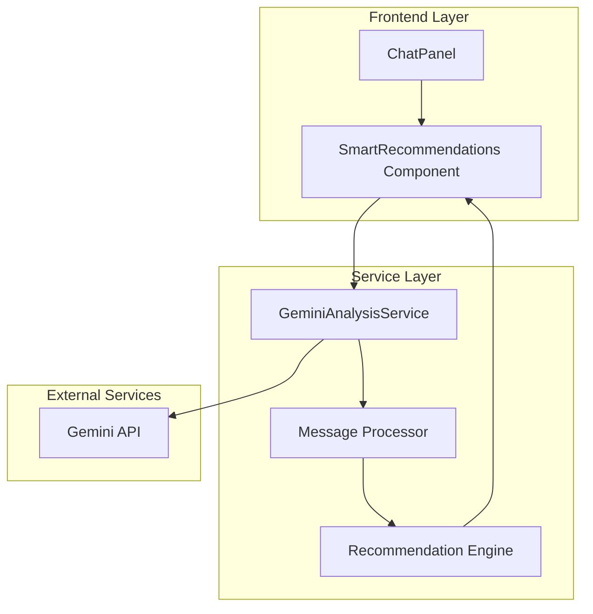

# Especificação Técnica - Análise Inteligente de Mensagens com Gemini

## 1. Visão Geral

Esta especificação define a implementação de uma funcionalidade de análise inteligente que utiliza o modelo Gemini para analisar as últimas 20 mensagens do chat de atendimento e gerar recomendações de próximas ações para a equipe.

### 1.1 Objetivos

* Analisar automaticamente o histórico de conversas

* Identificar o estágio atual da conversa

* Gerar recomendações contextualizadas de ações

* Melhorar a eficiência do atendimento

### 1.2 Escopo

* Integração com API do Gemini

* Análise das últimas 20 mensagens

* Geração de 3 tipos de recomendações: ligar, enviar proposta, agendar demonstração

* Interface visual integrada ao ChatPanel

## 2. Arquitetura da Solução



## 3. Tipos de Dados

### 3.1 Interfaces de Análise

```typescript
// Tipos para análise de mensagens
export interface MessageAnalysisInput {
  messages: Message[];
  clientInfo: Client;
  conversationContext: ConversationContext;
}

export interface ConversationContext {
  duration: number; // em minutos
  messageCount: number;
  lastClientMessage: Date;
  hasUnreadMessages: boolean;
  previousInteractions: number;
}

// Tipos para recomendações
export type RecommendationAction = 'call' | 'proposal' | 'demo';

export interface SmartRecommendation {
  id: string;
  action: RecommendationAction;
  title: string;
  description: string;
  confidence: number; // 0-100
  reasoning: string;
  priority: 'low' | 'medium' | 'high';
  suggestedTiming: 'immediate' | 'within_hour' | 'within_day';
  createdAt: Date;
}

export interface AnalysisResult {
  conversationStage: ConversationStage;
  clientSentiment: 'positive' | 'neutral' | 'negative';
  urgencyLevel: 'low' | 'medium' | 'high';
  keyTopics: string[];
  recommendations: SmartRecommendation[];
  summary: string;
  confidence: number;
}

export type ConversationStage = 
  | 'initial_contact'
  | 'information_gathering'
  | 'needs_assessment'
  | 'proposal_discussion'
  | 'negotiation'
  | 'closing'
  | 'post_sale'
  | 'support';
```

### 3.2 Configuração do Gemini

```typescript
export interface GeminiConfig {
  apiKey: string;
  model: string;
  temperature: number;
  maxTokens: number;
  systemPrompt: string;
}

export interface GeminiRequest {
  messages: GeminiMessage[];
  config: Partial<GeminiConfig>;
}

export interface GeminiMessage {
  role: 'user' | 'assistant' | 'system';
  content: string;
  timestamp?: Date;
}
```

## 4. Service de Análise

### 4.1 GeminiAnalysisService

````typescript
// src/services/gemini-analysis-service.ts
'use server';

import { GoogleGenerativeAI } from '@google/generative-ai';
import type { 
  MessageAnalysisInput, 
  AnalysisResult, 
  SmartRecommendation,
  ConversationStage 
} from '@/components/crm/types';

class GeminiAnalysisService {
  private genAI: GoogleGenerativeAI;
  private model: any;

  constructor() {
    this.genAI = new GoogleGenerativeAI(process.env.GEMINI_API_KEY!);
    this.model = this.genAI.getGenerativeModel({ model: 'gemini-pro' });
  }

  async analyzeConversation(input: MessageAnalysisInput): Promise<AnalysisResult> {
    try {
      const prompt = this.buildAnalysisPrompt(input);
      const result = await this.model.generateContent(prompt);
      const response = result.response.text();
      
      return this.parseGeminiResponse(response);
    } catch (error) {
      console.error('Erro na análise do Gemini:', error);
      return this.getFallbackAnalysis();
    }
  }

  private buildAnalysisPrompt(input: MessageAnalysisInput): string {
    const { messages, clientInfo, conversationContext } = input;
    
    const conversationText = messages
      .slice(-20) // Últimas 20 mensagens
      .map(msg => `${msg.sender}: ${msg.content}`)
      .join('\n');

    return `
Você é um assistente de análise de atendimento ao cliente especializado em CRM.

Analise a seguinte conversa e forneça recomendações de próximas ações:

**Informações do Cliente:**
- Nome: ${clientInfo.name}
- Telefone: ${clientInfo.phone}
- Email: ${clientInfo.email || 'Não informado'}
- Empresa: ${clientInfo.company || 'Não informado'}

**Contexto da Conversa:**
- Duração: ${conversationContext.duration} minutos
- Total de mensagens: ${conversationContext.messageCount}
- Última mensagem do cliente: ${conversationContext.lastClientMessage}
- Interações anteriores: ${conversationContext.previousInteractions}

**Histórico das Últimas 20 Mensagens:**
${conversationText}

**Instruções:**
1. Identifique o estágio atual da conversa
2. Analise o sentimento do cliente
3. Determine o nível de urgência
4. Identifique tópicos-chave
5. Gere até 3 recomendações de ação

**Tipos de Ação Disponíveis:**
- call: Ligar para o cliente
- proposal: Enviar proposta comercial
- demo: Agendar demonstração

**Formato de Resposta (JSON):**
{
  "conversationStage": "initial_contact|information_gathering|needs_assessment|proposal_discussion|negotiation|closing|post_sale|support",
  "clientSentiment": "positive|neutral|negative",
  "urgencyLevel": "low|medium|high",
  "keyTopics": ["tópico1", "tópico2"],
  "recommendations": [
    {
      "action": "call|proposal|demo",
      "title": "Título da recomendação",
      "description": "Descrição detalhada",
      "confidence": 85,
      "reasoning": "Justificativa da recomendação",
      "priority": "low|medium|high",
      "suggestedTiming": "immediate|within_hour|within_day"
    }
  ],
  "summary": "Resumo da análise",
  "confidence": 90
}
`;
  }

  private parseGeminiResponse(response: string): AnalysisResult {
    try {
      // Remove markdown code blocks se existirem
      const cleanResponse = response.replace(/```json\n?|```\n?/g, '').trim();
      const parsed = JSON.parse(cleanResponse);
      
      // Adiciona IDs e timestamps às recomendações
      const recommendations: SmartRecommendation[] = parsed.recommendations.map((rec: any, index: number) => ({
        id: `rec_${Date.now()}_${index}`,
        ...rec,
        createdAt: new Date()
      }));

      return {
        ...parsed,
        recommendations
      };
    } catch (error) {
      console.error('Erro ao parsear resposta do Gemini:', error);
      return this.getFallbackAnalysis();
    }
  }

  private getFallbackAnalysis(): AnalysisResult {
    return {
      conversationStage: 'information_gathering',
      clientSentiment: 'neutral',
      urgencyLevel: 'medium',
      keyTopics: ['Atendimento geral'],
      recommendations: [
        {
          id: `fallback_${Date.now()}`,
          action: 'call',
          title: 'Entrar em contato',
          description: 'Recomendamos entrar em contato para dar continuidade ao atendimento.',
          confidence: 50,
          reasoning: 'Análise automática não disponível no momento.',
          priority: 'medium',
          suggestedTiming: 'within_hour',
          createdAt: new Date()
        }
      ],
      summary: 'Análise simplificada - sistema de IA temporariamente indisponível.',
      confidence: 50
    };
  }
}

export const geminiAnalysisService = new GeminiAnalysisService();
````

## 5. Componente de Recomendações

### 5.1 SmartRecommendations Component

```typescript
// src/components/crm/SmartRecommendations.tsx
'use client';

import React, { useState, useEffect } from 'react';
import { Card, CardContent, CardHeader, CardTitle } from '@/components/ui/card';
import { Button } from '@/components/ui/button';
import { Badge } from '@/components/ui/badge';
import { Separator } from '@/components/ui/separator';
import { 
  Brain, 
  Phone, 
  FileText, 
  Calendar, 
  TrendingUp, 
  Clock, 
  AlertCircle,
  CheckCircle,
  Loader2,
  RefreshCw
} from 'lucide-react';
import { cn } from '@/lib/utils';
import type { 
  Ticket, 
  AnalysisResult, 
  SmartRecommendation, 
  RecommendationAction 
} from '@/components/crm/types';
import { geminiAnalysisService } from '@/services/gemini-analysis-service';

interface SmartRecommendationsProps {
  ticket: Ticket;
  onActionSelected: (action: RecommendationAction, recommendation: SmartRecommendation) => void;
  className?: string;
}

const actionIcons = {
  call: Phone,
  proposal: FileText,
  demo: Calendar
};

const actionLabels = {
  call: 'Ligar',
  proposal: 'Enviar Proposta',
  demo: 'Agendar Demo'
};

const priorityColors = {
  low: 'bg-gray-100 text-gray-800 dark:bg-gray-800 dark:text-gray-300',
  medium: 'bg-yellow-100 text-yellow-800 dark:bg-yellow-900/50 dark:text-yellow-300',
  high: 'bg-red-100 text-red-800 dark:bg-red-900/50 dark:text-red-300'
};

const sentimentColors = {
  positive: 'text-green-600 dark:text-green-400',
  neutral: 'text-gray-600 dark:text-gray-400',
  negative: 'text-red-600 dark:text-red-400'
};

export default function SmartRecommendations({ 
  ticket, 
  onActionSelected, 
  className 
}: SmartRecommendationsProps) {
  const [analysis, setAnalysis] = useState<AnalysisResult | null>(null);
  const [isLoading, setIsLoading] = useState(false);
  const [lastAnalysis, setLastAnalysis] = useState<Date | null>(null);
  const [error, setError] = useState<string | null>(null);

  const analyzeConversation = async () => {
    if (!ticket.messages.length) return;
    
    setIsLoading(true);
    setError(null);
    
    try {
      const conversationContext = {
        duration: Math.floor((Date.now() - ticket.createdAt.getTime()) / (1000 * 60)),
        messageCount: ticket.messages.length,
        lastClientMessage: ticket.lastMessageTime || ticket.createdAt,
        hasUnreadMessages: ticket.unreadCount > 0,
        previousInteractions: 0 // TODO: Implementar histórico
      };

      const result = await geminiAnalysisService.analyzeConversation({
        messages: ticket.messages,
        clientInfo: ticket.client,
        conversationContext
      });

      setAnalysis(result);
      setLastAnalysis(new Date());
    } catch (err) {
      setError('Erro ao analisar conversa. Tente novamente.');
      console.error('Erro na análise:', err);
    } finally {
      setIsLoading(false);
    }
  };

  useEffect(() => {
    // Análise automática quando há novas mensagens
    if (ticket.messages.length > 0 && !lastAnalysis) {
      analyzeConversation();
    }
  }, [ticket.messages.length]);

  const handleActionClick = (recommendation: SmartRecommendation) => {
    onActionSelected(recommendation.action, recommendation);
  };

  if (isLoading) {
    return (
      <Card className={cn('w-full', className)}>
        <CardHeader className="pb-3">
          <CardTitle className="flex items-center gap-2 text-sm">
            <Brain className="w-4 h-4" />
            Análise Inteligente
          </CardTitle>
        </CardHeader>
        <CardContent>
          <div className="flex items-center justify-center py-8">
            <div className="flex flex-col items-center gap-2">
              <Loader2 className="w-6 h-6 animate-spin text-blue-600" />
              <p className="text-sm text-muted-foreground">Analisando conversa...</p>
            </div>
          </div>
        </CardContent>
      </Card>
    );
  }

  if (error) {
    return (
      <Card className={cn('w-full', className)}>
        <CardHeader className="pb-3">
          <CardTitle className="flex items-center gap-2 text-sm">
            <Brain className="w-4 h-4" />
            Análise Inteligente
          </CardTitle>
        </CardHeader>
        <CardContent>
          <div className="flex flex-col items-center gap-3 py-4">
            <AlertCircle className="w-8 h-8 text-red-500" />
            <p className="text-sm text-center text-muted-foreground">{error}</p>
            <Button 
              size="sm" 
              variant="outline" 
              onClick={analyzeConversation}
              className="flex items-center gap-2"
            >
              <RefreshCw className="w-3 h-3" />
              Tentar Novamente
            </Button>
          </div>
        </CardContent>
      </Card>
    );
  }

  if (!analysis) {
    return (
      <Card className={cn('w-full', className)}>
        <CardHeader className="pb-3">
          <CardTitle className="flex items-center gap-2 text-sm">
            <Brain className="w-4 h-4" />
            Análise Inteligente
          </CardTitle>
        </CardHeader>
        <CardContent>
          <div className="flex flex-col items-center gap-3 py-4">
            <TrendingUp className="w-8 h-8 text-gray-400" />
            <p className="text-sm text-center text-muted-foreground">
              Clique para analisar a conversa e receber recomendações inteligentes.
            </p>
            <Button 
              size="sm" 
              onClick={analyzeConversation}
              className="flex items-center gap-2"
            >
              <Brain className="w-3 h-3" />
              Analisar Conversa
            </Button>
          </div>
        </CardContent>
      </Card>
    );
  }

  return (
    <Card className={cn('w-full', className)}>
      <CardHeader className="pb-3">
        <div className="flex items-center justify-between">
          <CardTitle className="flex items-center gap-2 text-sm">
            <Brain className="w-4 h-4" />
            Análise Inteligente
          </CardTitle>
          <Button 
            size="sm" 
            variant="ghost" 
            onClick={analyzeConversation}
            className="h-6 w-6 p-0"
            title="Atualizar análise"
          >
            <RefreshCw className="w-3 h-3" />
          </Button>
        </div>
      </CardHeader>
      
      <CardContent className="space-y-4">
        {/* Status da Conversa */}
        <div className="space-y-2">
          <div className="flex items-center justify-between text-xs">
            <span className="text-muted-foreground">Estágio:</span>
            <Badge variant="secondary" className="text-xs">
              {analysis.conversationStage.replace('_', ' ')}
            </Badge>
          </div>
          
          <div className="flex items-center justify-between text-xs">
            <span className="text-muted-foreground">Sentimento:</span>
            <span className={cn('font-medium', sentimentColors[analysis.clientSentiment])}>
              {analysis.clientSentiment === 'positive' ? 'Positivo' :
               analysis.clientSentiment === 'neutral' ? 'Neutro' : 'Negativo'}
            </span>
          </div>
          
          <div className="flex items-center justify-between text-xs">
            <span className="text-muted-foreground">Urgência:</span>
            <Badge className={cn('text-xs', priorityColors[analysis.urgencyLevel])}>
              {analysis.urgencyLevel === 'low' ? 'Baixa' :
               analysis.urgencyLevel === 'medium' ? 'Média' : 'Alta'}
            </Badge>
          </div>
        </div>

        <Separator />

        {/* Resumo */}
        <div>
          <h4 className="text-xs font-medium text-muted-foreground mb-1">Resumo</h4>
          <p className="text-xs text-foreground leading-relaxed">{analysis.summary}</p>
        </div>

        {/* Tópicos Chave */}
        {analysis.keyTopics.length > 0 && (
          <div>
            <h4 className="text-xs font-medium text-muted-foreground mb-2">Tópicos Principais</h4>
            <div className="flex flex-wrap gap-1">
              {analysis.keyTopics.map((topic, index) => (
                <Badge key={index} variant="outline" className="text-xs">
                  {topic}
                </Badge>
              ))}
            </div>
          </div>
        )}

        <Separator />

        {/* Recomendações */}
        <div>
          <h4 className="text-xs font-medium text-muted-foreground mb-2">Próximas Ações Recomendadas</h4>
          <div className="space-y-2">
            {analysis.recommendations.map((rec) => {
              const Icon = actionIcons[rec.action];
              return (
                <div 
                  key={rec.id} 
                  className="p-3 rounded-lg border bg-card hover:bg-accent/50 transition-colors cursor-pointer"
                  onClick={() => handleActionClick(rec)}
                >
                  <div className="flex items-start gap-2">
                    <Icon className="w-4 h-4 mt-0.5 text-blue-600" />
                    <div className="flex-1 min-w-0">
                      <div className="flex items-center justify-between mb-1">
                        <h5 className="text-xs font-medium truncate">{rec.title}</h5>
                        <div className="flex items-center gap-1">
                          <Badge className={cn('text-xs', priorityColors[rec.priority])}>
                            {rec.priority === 'low' ? 'Baixa' :
                             rec.priority === 'medium' ? 'Média' : 'Alta'}
                          </Badge>
                          <span className="text-xs text-muted-foreground">
                            {rec.confidence}%
                          </span>
                        </div>
                      </div>
                      
                      <p className="text-xs text-muted-foreground mb-2 leading-relaxed">
                        {rec.description}
                      </p>
                      
                      <div className="flex items-center justify-between">
                        <div className="flex items-center gap-1 text-xs text-muted-foreground">
                          <Clock className="w-3 h-3" />
                          {rec.suggestedTiming === 'immediate' ? 'Imediato' :
                           rec.suggestedTiming === 'within_hour' ? 'Em 1h' : 'Hoje'}
                        </div>
                        
                        <Button size="sm" className="h-6 text-xs">
                          {actionLabels[rec.action]}
                        </Button>
                      </div>
                    </div>
                  </div>
                </div>
              );
            })}
          </div>
        </div>

        {/* Footer */}
        <div className="flex items-center justify-between pt-2 text-xs text-muted-foreground">
          <div className="flex items-center gap-1">
            <CheckCircle className="w-3 h-3" />
            Confiança: {analysis.confidence}%
          </div>
          {lastAnalysis && (
            <span>
              {lastAnalysis.toLocaleTimeString('pt-BR', { 
                hour: '2-digit', 
                minute: '2-digit' 
              })}
            </span>
          )}
        </div>
      </CardContent>
    </Card>
  );
}
```

## 6. Integração com ChatPanel

### 6.1 Modificações no ChatPanel

```typescript
// Adicionar ao ChatPanel.tsx
import SmartRecommendations from '@/components/crm/SmartRecommendations';
import type { RecommendationAction, SmartRecommendation } from '@/components/crm/types';

// Adicionar props
interface ChatPanelProps {
  // ... props existentes
  onRecommendationAction?: (action: RecommendationAction, recommendation: SmartRecommendation) => void;
}

// Adicionar handler
const handleRecommendationAction = (action: RecommendationAction, recommendation: SmartRecommendation) => {
  console.log('Ação recomendada:', action, recommendation);
  
  switch (action) {
    case 'call':
      // Integrar com sistema de telefonia
      window.open(`tel:${ticket.client.phone}`);
      break;
    case 'proposal':
      // Abrir modal de proposta ou navegar para página
      onUseTemplate?.(ticket.id);
      break;
    case 'demo':
      // Abrir agenda para agendar demonstração
      onScheduleFollowup?.(ticket.id);
      break;
  }
  
  onRecommendationAction?.(action, recommendation);
};

// Adicionar componente na seção de informações contextuais
{showContextInfo && (
  <div className="border-b p-4 bg-muted/30">
    <TicketContextInfo ticket={ticket} />
    <div className="mt-4">
      <SmartRecommendations 
        ticket={ticket}
        onActionSelected={handleRecommendationAction}
      />
    </div>
  </div>
)}
```

## 7. API Routes

### 7.1 Endpoint de Análise

```typescript
// src/app/api/chat/analyze/route.ts
import { NextRequest, NextResponse } from 'next/server';
import { geminiAnalysisService } from '@/services/gemini-analysis-service';
import type { MessageAnalysisInput } from '@/components/crm/types';

export async function POST(request: NextRequest) {
  try {
    const body: MessageAnalysisInput = await request.json();
    
    // Validação básica
    if (!body.messages || !body.clientInfo) {
      return NextResponse.json(
        { error: 'Dados de entrada inválidos' },
        { status: 400 }
      );
    }

    const result = await geminiAnalysisService.analyzeConversation(body);
    
    return NextResponse.json(result);
  } catch (error) {
    console.error('Erro na análise:', error);
    return NextResponse.json(
      { error: 'Erro interno do servidor' },
      { status: 500 }
    );
  }
}
```

## 8. Configuração e Deploy

### 8.1 Variáveis de Ambiente

```env
# .env.local
GEMINI_API_KEY=sua_chave_do_gemini_aqui
```

### 8.2 Dependências

```json
{
  "dependencies": {
    "@google/generative-ai": "^0.2.1"
  }
}
```

### 8.3 Instalação

```bash
npm install @google/generative-ai
```

## 9. Testes e Validação

### 9.1 Casos de Teste

1. **Conversa Inicial**: Cliente fazendo primeiro contato
2. **Negociação Avançada**: Cliente interessado, discutindo preços
3. **Suporte Técnico**: Cliente com problema específico
4. **Follow-up**: Retomada de conversa anterior

### 9.2 Métricas de Sucesso

* Precisão das recomendações (feedback dos agentes)

* Tempo de resposta da análise (< 3 segundos)

* Taxa de adoção das recomendações

* Melhoria na conversão de leads

## 10. Considerações de Segurança

* API Key do Gemini deve ser armazenada como variável de ambiente

* Dados sensíveis não devem ser enviados para análise

* Implementar rate limiting para evitar abuso

* Log de auditoria para análises realizadas

## 11. Roadmap Futuro

* Integração com histórico completo do cliente

* Análise de sentimento em tempo real

* Recomendações personalizadas por agente

* Dashboard de métricas de IA

* Treinamento do modelo com dados específicos da empresa

