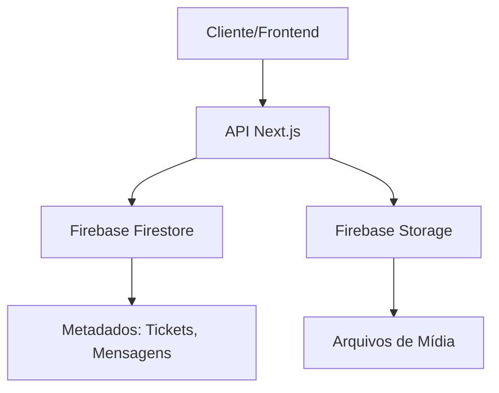
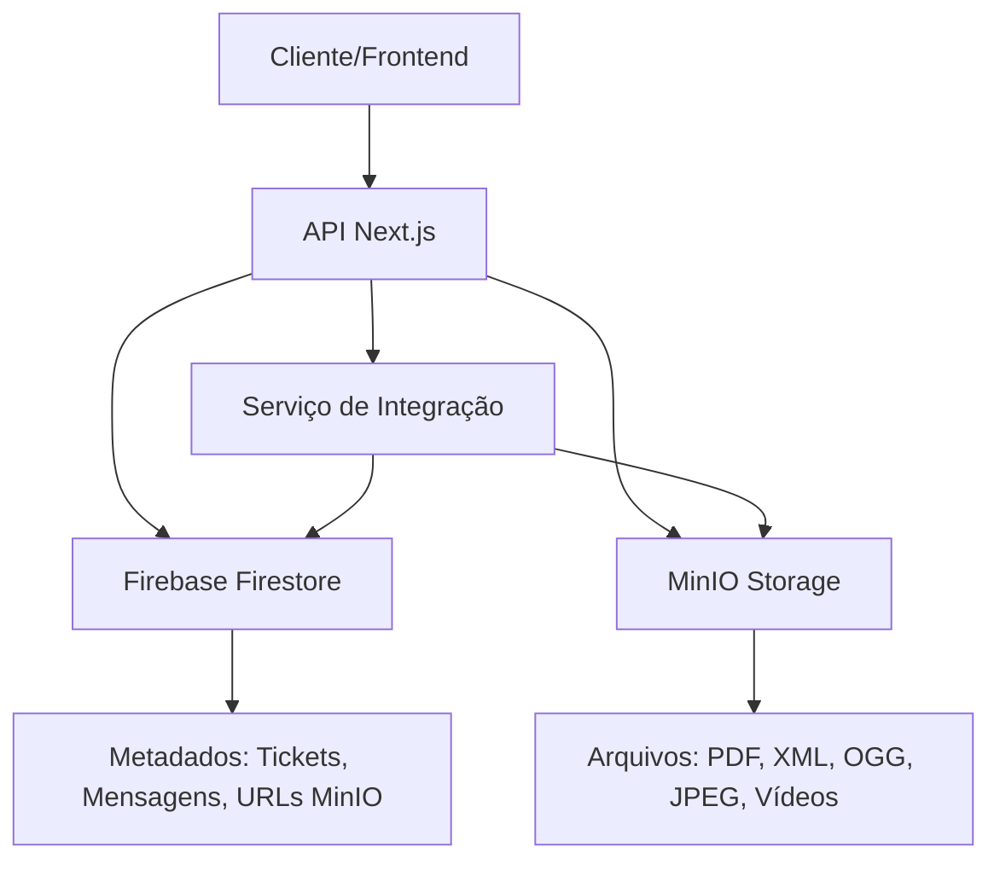

# Migração do Sistema de Armazenamento: Firebase Storage → MinIO

## 1. Visão Geral do Projeto

Este documento descreve a migração do sistema de armazenamento de arquivos do Firebase Storage para MinIO, mantendo uma arquitetura híbrida onde:
- **Firebase Firestore**: Continua armazenando metadados de instâncias, tickets e mensagens
- **MinIO**: Passa a armazenar exclusivamente os arquivos de mídia
- **Formatos Suportados**: PDF, XML, áudio OGG, imagens JPEG e vídeos

### Objetivos da Migração
- Reduzir custos de armazenamento
- Melhorar performance de upload/download
- Manter compatibilidade com sistema existente
- Garantir segurança e integridade dos dados

## 2. Arquitetura do Sistema

### 2.1 Arquitetura Atual (Firebase)


### 2.2 Nova Arquitetura (Híbrida)


### 2.3 Fluxo de Dados
1. **Upload**: Cliente → API → Validação de formato → MinIO → URL salva no Firestore
2. **Download**: Cliente → API → Busca URL no Firestore → Proxy/Redirect para MinIO
3. **Integração**: Mensagens do Firestore referenciam arquivos do MinIO via URL

## 3. Configuração do MinIO

### 3.1 Credenciais e Configuração
```env
MINIO_SERVER_URL=https://n8n-minio.05pdov.easypanel.host
MINIO_ROOT_USER=admin
MINIO_ROOT_PASSWORD=Devs@0101
MINIO_BUCKET_NAME=crm-media-files
MINIO_REGION=us-east-1
```

### 3.2 Estrutura de Buckets
```
crm-media-files/
├── images/
│   ├── 2025/
│   │   ├── 01/
│   │   └── 02/
├── documents/
│   ├── pdf/
│   └── xml/
├── audio/
│   └── ogg/
└── videos/
    ├── mp4/
    └── webm/
```

## 4. Implementação Técnica

### 4.1 Serviço MinIO
```typescript
// src/services/minio-service.ts
import { Client } from 'minio';

export class MinIOService {
  private client: Client;
  private bucketName = 'crm-media-files';

  constructor() {
    this.client = new Client({
      endPoint: process.env.MINIO_SERVER_URL!.replace('https://', ''),
      useSSL: true,
      accessKey: process.env.MINIO_ROOT_USER!,
      secretKey: process.env.MINIO_ROOT_PASSWORD!,
      region: process.env.MINIO_REGION || 'us-east-1'
    });
  }

  async uploadFile(buffer: Buffer, fileName: string, contentType: string): Promise<string> {
    const objectName = this.generateObjectPath(fileName, contentType);
    
    await this.client.putObject(
      this.bucketName,
      objectName,
      buffer,
      buffer.length,
      { 'Content-Type': contentType }
    );

    return this.getFileUrl(objectName);
  }

  private generateObjectPath(fileName: string, contentType: string): string {
    const date = new Date();
    const year = date.getFullYear();
    const month = String(date.getMonth() + 1).padStart(2, '0');
    
    const category = this.getCategoryFromContentType(contentType);
    return `${category}/${year}/${month}/${fileName}`;
  }

  private getCategoryFromContentType(contentType: string): string {
    if (contentType.startsWith('image/')) return 'images';
    if (contentType.startsWith('audio/')) return 'audio';
    if (contentType.startsWith('video/')) return 'videos';
    if (contentType === 'application/pdf') return 'documents/pdf';
    if (contentType === 'application/xml' || contentType === 'text/xml') return 'documents/xml';
    return 'documents';
  }

  private getFileUrl(objectName: string): string {
    return `${process.env.MINIO_SERVER_URL}/${this.bucketName}/${objectName}`;
  }
}
```

### 4.2 Validação de Formatos
```typescript
// src/services/file-validator.ts
export class FileValidator {
  private static allowedMimeTypes = [
    'application/pdf',
    'application/xml',
    'text/xml',
    'audio/ogg',
    'image/jpeg',
    'video/mp4',
    'video/webm',
    'video/avi',
    'video/mov'
  ];

  private static allowedExtensions = [
    '.pdf',
    '.xml',
    '.ogg',
    '.jpg',
    '.jpeg',
    '.mp4',
    '.webm',
    '.avi',
    '.mov'
  ];

  static isValidFile(fileName: string, mimeType: string): boolean {
    const extension = this.getFileExtension(fileName);
    return this.allowedMimeTypes.includes(mimeType) && 
           this.allowedExtensions.includes(extension);
  }

  static getFileExtension(fileName: string): string {
    return fileName.toLowerCase().substring(fileName.lastIndexOf('.'));
  }

  static validateAndNormalize(fileName: string, mimeType: string): { isValid: boolean; normalizedName: string; error?: string } {
    if (!this.isValidFile(fileName, mimeType)) {
      return {
        isValid: false,
        normalizedName: '',
        error: `Formato não suportado. Formatos permitidos: ${this.allowedExtensions.join(', ')}`
      };
    }

    const normalizedName = this.normalizeFileName(fileName);
    return { isValid: true, normalizedName };
  }

  private static normalizeFileName(fileName: string): string {
    const timestamp = Date.now();
    const extension = this.getFileExtension(fileName);
    const baseName = fileName.replace(extension, '').replace(/[^a-zA-Z0-9]/g, '_');
    return `${baseName}_${timestamp}${extension}`;
  }
}
```

### 4.3 Serviço de Integração
```typescript
// src/services/media-integration-service.ts
import { MinIOService } from './minio-service';
import { FileValidator } from './file-validator';
import { firebaseService } from './firebase-service';

export class MediaIntegrationService {
  private minioService: MinIOService;

  constructor() {
    this.minioService = new MinIOService();
  }

  async uploadAndSaveReference(
    buffer: Buffer,
    fileName: string,
    mimeType: string,
    messageId: string,
    ticketId: string
  ): Promise<{ success: boolean; url?: string; error?: string }> {
    try {
      // Validar arquivo
      const validation = FileValidator.validateAndNormalize(fileName, mimeType);
      if (!validation.isValid) {
        return { success: false, error: validation.error };
      }

      // Upload para MinIO
      const minioUrl = await this.minioService.uploadFile(
        buffer,
        validation.normalizedName,
        mimeType
      );

      // Salvar referência no Firebase
      await this.saveFileReference(messageId, ticketId, {
        fileName: validation.normalizedName,
        originalName: fileName,
        mimeType,
        size: buffer.length,
        url: minioUrl,
        uploadedAt: new Date(),
        storage: 'minio'
      });

      return { success: true, url: minioUrl };
    } catch (error) {
      console.error('Erro no upload:', error);
      return { success: false, error: 'Erro interno no upload' };
    }
  }

  private async saveFileReference(
    messageId: string,
    ticketId: string,
    fileData: any
  ): Promise<void> {
    // Atualizar documento da mensagem com referência do arquivo
    await firebaseService.updateDocument(`tickets/${ticketId}/messages`, messageId, {
      mediaUrl: fileData.url,
      mediaMetadata: fileData,
      updatedAt: new Date()
    });

    // Log para auditoria
    await firebaseService.addDocument('media_uploads', {
      messageId,
      ticketId,
      ...fileData
    });
  }

  async getFileUrl(messageId: string): Promise<string | null> {
    try {
      const message = await firebaseService.getDocument('messages', messageId);
      return message?.mediaUrl || null;
    } catch (error) {
      console.error('Erro ao buscar URL do arquivo:', error);
      return null;
    }
  }
}
```

## 5. Estratégia de Migração

### 5.1 Fases da Migração

#### Fase 1: Preparação (1-2 dias)
- [ ] Configurar MinIO na VPS
- [ ] Implementar serviços de integração
- [ ] Criar testes unitários
- [ ] Configurar ambiente de staging

#### Fase 2: Implementação Paralela (3-5 dias)
- [ ] Implementar upload dual (Firebase + MinIO)
- [ ] Atualizar frontend para suportar ambos
- [ ] Testar funcionalidades críticas
- [ ] Monitorar performance

#### Fase 3: Migração de Dados (1-3 dias)
- [ ] Script de migração de arquivos existentes
- [ ] Validação de integridade
- [ ] Atualização de referências no Firestore
- [ ] Backup de segurança

#### Fase 4: Finalização (1 dia)
- [ ] Desativar uploads para Firebase
- [ ] Remover código legado
- [ ] Monitoramento pós-migração
- [ ] Documentação final

### 5.2 Script de Migração
```typescript
// scripts/migrate-to-minio.ts
import { MinIOService } from '../src/services/minio-service';
import { firebaseService } from '../src/services/firebase-service';

export class MigrationScript {
  private minioService: MinIOService;
  private batchSize = 50;

  constructor() {
    this.minioService = new MinIOService();
  }

  async migrateAllFiles(): Promise<void> {
    console.log('Iniciando migração de arquivos...');
    
    // Buscar todas as mensagens com arquivos
    const messages = await this.getAllMessagesWithMedia();
    console.log(`Encontradas ${messages.length} mensagens com mídia`);

    // Processar em lotes
    for (let i = 0; i < messages.length; i += this.batchSize) {
      const batch = messages.slice(i, i + this.batchSize);
      await this.processBatch(batch, i / this.batchSize + 1);
    }

    console.log('Migração concluída!');
  }

  private async processBatch(messages: any[], batchNumber: number): Promise<void> {
    console.log(`Processando lote ${batchNumber}...`);
    
    const promises = messages.map(async (message) => {
      try {
        await this.migrateFile(message);
        return { success: true, messageId: message.id };
      } catch (error) {
        console.error(`Erro ao migrar ${message.id}:`, error);
        return { success: false, messageId: message.id, error };
      }
    });

    const results = await Promise.allSettled(promises);
    const successful = results.filter(r => r.status === 'fulfilled').length;
    console.log(`Lote ${batchNumber}: ${successful}/${messages.length} migrados com sucesso`);
  }

  private async migrateFile(message: any): Promise<void> {
    if (!message.mediaUrl || message.storage === 'minio') {
      return; // Já migrado ou sem mídia
    }

    // Download do Firebase
    const fileBuffer = await this.downloadFromFirebase(message.mediaUrl);
    
    // Upload para MinIO
    const minioUrl = await this.minioService.uploadFile(
      fileBuffer,
      message.fileName || `migrated_${message.id}`,
      message.mimeType || 'application/octet-stream'
    );

    // Atualizar referência
    await this.updateMessageReference(message.id, minioUrl);
  }

  private async downloadFromFirebase(url: string): Promise<Buffer> {
    const response = await fetch(url);
    if (!response.ok) {
      throw new Error(`Erro ao baixar arquivo: ${response.statusText}`);
    }
    return Buffer.from(await response.arrayBuffer());
  }

  private async updateMessageReference(messageId: string, newUrl: string): Promise<void> {
    await firebaseService.updateDocument('messages', messageId, {
      mediaUrl: newUrl,
      storage: 'minio',
      migratedAt: new Date()
    });
  }

  private async getAllMessagesWithMedia(): Promise<any[]> {
    // Implementar busca paginada de mensagens com mídia
    return await firebaseService.queryDocuments('messages', {
      where: [['mediaUrl', '!=', null]],
      orderBy: [['createdAt', 'desc']]
    });
  }
}
```

## 6. Configuração de Ambiente

### 6.1 Variáveis de Ambiente
```env
# MinIO Configuration
MINIO_SERVER_URL=https://n8n-minio.05pdov.easypanel.host
MINIO_ROOT_USER=admin
MINIO_ROOT_PASSWORD=Devs@0101
MINIO_BUCKET_NAME=crm-media-files
MINIO_REGION=us-east-1

# Migration Settings
MIGRATION_BATCH_SIZE=50
MIGRATION_ENABLED=true
DUAL_UPLOAD_MODE=false

# File Validation
MAX_FILE_SIZE=50MB
ALLOWED_EXTENSIONS=pdf,xml,ogg,jpg,jpeg,mp4,webm,avi,mov
```

### 6.2 Dependências
```json
{
  "dependencies": {
    "minio": "^7.1.3",
    "mime-types": "^2.1.35",
    "file-type": "^18.7.0"
  },
  "devDependencies": {
    "@types/minio": "^7.1.1",
    "@types/mime-types": "^2.1.4"
  }
}
```

## 7. Testes e Validação

### 7.1 Testes Unitários
```typescript
// tests/minio-service.test.ts
import { MinIOService } from '../src/services/minio-service';
import { FileValidator } from '../src/services/file-validator';

describe('MinIOService', () => {
  let service: MinIOService;

  beforeEach(() => {
    service = new MinIOService();
  });

  test('deve fazer upload de arquivo válido', async () => {
    const buffer = Buffer.from('test content');
    const fileName = 'test.pdf';
    const contentType = 'application/pdf';

    const url = await service.uploadFile(buffer, fileName, contentType);
    expect(url).toContain('crm-media-files');
    expect(url).toContain('documents/pdf');
  });

  test('deve rejeitar formato inválido', () => {
    const result = FileValidator.validateAndNormalize('test.exe', 'application/exe');
    expect(result.isValid).toBe(false);
    expect(result.error).toContain('Formato não suportado');
  });
});
```

### 7.2 Testes de Integração
```typescript
// tests/integration/media-flow.test.ts
import { MediaIntegrationService } from '../src/services/media-integration-service';

describe('Fluxo Completo de Mídia', () => {
  test('deve processar upload completo', async () => {
    const service = new MediaIntegrationService();
    const buffer = Buffer.from('test image content');
    
    const result = await service.uploadAndSaveReference(
      buffer,
      'test.jpg',
      'image/jpeg',
      'msg123',
      'ticket456'
    );

    expect(result.success).toBe(true);
    expect(result.url).toBeDefined();
  });
});
```

## 8. Monitoramento e Logs

### 8.1 Métricas de Monitoramento
- Taxa de sucesso de uploads
- Tempo de resposta de downloads
- Uso de armazenamento
- Erros de validação de formato
- Performance de migração

### 8.2 Logs Estruturados
```typescript
// src/utils/media-logger.ts
export class MediaLogger {
  static logUpload(fileName: string, size: number, duration: number, success: boolean) {
    console.log(JSON.stringify({
      event: 'media_upload',
      fileName,
      size,
      duration,
      success,
      timestamp: new Date().toISOString(),
      storage: 'minio'
    }));
  }

  static logMigration(messageId: string, status: 'started' | 'completed' | 'failed', error?: string) {
    console.log(JSON.stringify({
      event: 'file_migration',
      messageId,
      status,
      error,
      timestamp: new Date().toISOString()
    }));
  }
}
```

## 9. Segurança e Backup

### 9.1 Políticas de Segurança
- Validação rigorosa de tipos de arquivo
- Sanitização de nomes de arquivo
- Controle de acesso baseado em tokens
- Criptografia em trânsito (HTTPS)

### 9.2 Estratégia de Backup
- Backup diário automático do MinIO
- Retenção de 30 dias
- Backup incremental para otimização
- Teste de restauração mensal

## 10. Rollback e Contingência

### 10.1 Plano de Rollback
1. Reativar uploads para Firebase Storage
2. Reverter alterações no código
3. Restaurar referências antigas no Firestore
4. Validar funcionamento completo

### 10.2 Monitoramento Crítico
- Alertas para falhas de upload > 5%
- Monitoramento de latência > 2s
- Verificação de integridade de arquivos
- Dashboard de status em tempo real

---

**Status**: Documento técnico completo para implementação
**Próximos Passos**: Implementar serviços e iniciar fase de preparação
**Estimativa**: 7-10 dias para migração completa