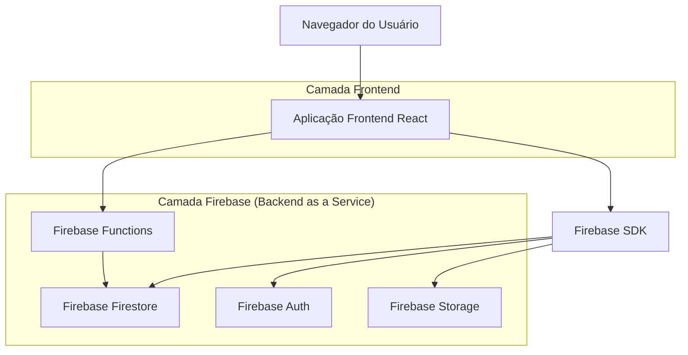
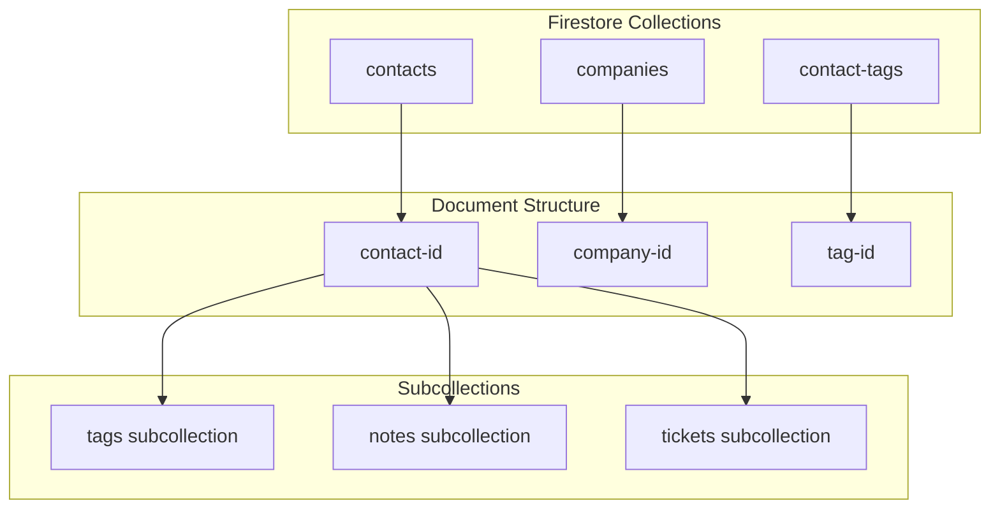

# Módulo de Gerenciamento de Clientes/Contatos - Arquitetura Técnica

## 1. Design da Arquitetura



## 2. Descrição das Tecnologias

* Frontend: React\@18 + TypeScript + Tailwind CSS + shadcn/ui + Next.js\@14

* Backend: Firebase (Firestore + Auth + Functions + Storage)

* Banco de Dados: Firebase Firestore (NoSQL)

* Autenticação: Firebase Auth

* Upload de Arquivos: Firebase Storage para avatars e anexos

* API: Firebase Functions para lógica de negócio

## 3. Definições de Rotas

| Rota                   | Propósito                                        |
| ---------------------- | ------------------------------------------------ |
| /contatos              | Página principal com lista de contatos e filtros |
| /contatos/novo         | Formulário para criar novo contato               |
| /contatos/\[id]        | Página de detalhes do contato específico         |
| /contatos/\[id]/editar | Formulário de edição do contato                  |
| /contatos/importar     | Interface para importação de contatos em lote    |
| /contatos/exportar     | Interface para exportação de dados               |

## 4. Definições de API

### 4.1 Firebase Functions

As APIs são implementadas como Firebase Functions que interagem diretamente com o Firestore.

**Gerenciamento de contatos**

```
POST /api/contacts/list
```

Request:

| Nome do Parâmetro | Tipo      | Obrigatório | Descrição                                  |
| ----------------- | --------- | ----------- | ------------------------------------------ |
| page              | number    | false       | Número da página para paginação            |
| limit             | number    | false       | Quantidade de itens por página             |
| search            | string    | false       | Termo de busca para nome, email ou empresa |
| tags              | string\[] | false       | Array de tags para filtrar                 |
| company           | string    | false       | Filtrar por empresa específica             |

Response:

| Nome do Parâmetro | Tipo       | Descrição                     |
| ----------------- | ---------- | ----------------------------- |
| contacts          | Contact\[] | Lista de contatos             |
| total             | number     | Total de contatos encontrados |
| page              | number     | Página atual                  |
| totalPages        | number     | Total de páginas              |

Exemplo:

```json
{
  "contacts": [
    {
      "id": "uuid-123",
      "name": "João Silva",
      "email": "joao@empresa.com",
      "phone": "+55 11 99999-9999",
      "company": "Empresa XYZ",
      "tags": ["cliente", "vip"]
    }
  ],
  "total": 150,
  "page": 1,
  "totalPages": 15
}
```

**Criar contato**

```
POST /api/contacts/create
```

Request:

| Nome do Parâmetro | Tipo      | Obrigatório | Descrição                          |
| ----------------- | --------- | ----------- | ---------------------------------- |
| name              | string    | true        | Nome completo do contato           |
| email             | string    | true        | Email válido                       |
| phone             | string    | false       | Telefone com formato internacional |
| company           | string    | false       | Nome da empresa                    |
| position          | string    | false       | Cargo na empresa                   |
| address           | object    | false       | Objeto com endereço completo       |
| tags              | string\[] | false       | Array de tags                      |
| notes             | string    | false       | Observações sobre o contato        |

**Atualizar contato**

```
POST /api/contacts/update
```

**Excluir contato**

```
POST /api/contacts/delete
```

**Importar contatos**

```
POST /api/contacts/import
```

Request:

| Nome do Parâmetro | Tipo    | Obrigatório | Descrição                 |
| ----------------- | ------- | ----------- | ------------------------- |
| file              | File    | true        | Arquivo CSV ou Excel      |
| mapping           | object  | true        | Mapeamento de colunas     |
| skipDuplicates    | boolean | false       | Pular contatos duplicados |

## 5. Modelo de Dados

### 5.1 Estrutura de Coleções Firestore



### 5.2 Estrutura dos Documentos

**Coleção: contacts**

```typescript
interface Contact {
  id: string; // Document ID
  name: string;
  email: string;
  phone?: string;
  companyId?: string; // Reference to companies collection
  position?: string;
  address?: {
    street: string;
    city: string;
    state: string;
    zipCode: string;
    country: string;
  };
  avatarUrl?: string;
  isActive: boolean;
  tags: string[]; // Array of tag names
  createdAt: Timestamp;
  updatedAt: Timestamp;
}
```

**Coleção: companies**

```typescript
interface Company {
  id: string; // Document ID
  name: string;
  website?: string;
  address?: {
    street: string;
    city: string;
    state: string;
    zipCode: string;
    country: string;
  };
  createdAt: Timestamp;
}
```

**Subcoleção: contacts/{contactId}/notes**

```typescript
interface ContactNote {
  id: string; // Document ID
  content: string;
  createdBy: string; // User ID
  createdAt: Timestamp;
}
```

**Coleção: contact-tags**

```typescript
interface ContactTag {
  id: string; // Document ID
  name: string;
  color: string;
  createdAt: Timestamp;
}
```

### 5.3 Regras de Segurança do Firestore

**firestore.rules**

```javascript
rules_version = '2';
service cloud.firestore {
  match /databases/{database}/documents {
    // Regras para coleção de contatos
    match /contacts/{contactId} {
      allow read, write: if request.auth != null;
      
      // Subcoleção de notas
      match /notes/{noteId} {
        allow read, write: if request.auth != null;
      }
      
      // Subcoleção de tickets
      match /tickets/{ticketId} {
        allow read, write: if request.auth != null;
      }
    }
    
    // Regras para coleção de empresas
    match /companies/{companyId} {
      allow read, write: if request.auth != null;
    }
    
    // Regras para tags de contatos
    match /contact-tags/{tagId} {
      allow read, write: if request.auth != null;
    }
  }
}
```

### 5.4 Índices do Firestore

**firestore.indexes.json**

```json
{
  "indexes": [
    {
      "collectionGroup": "contacts",
      "queryScope": "COLLECTION",
      "fields": [
        {
          "fieldPath": "email",
          "order": "ASCENDING"
        }
      ]
    },
    {
      "collectionGroup": "contacts",
      "queryScope": "COLLECTION",
      "fields": [
        {
          "fieldPath": "name",
          "order": "ASCENDING"
        }
      ]
    },
    {
      "collectionGroup": "contacts",
      "queryScope": "COLLECTION",
      "fields": [
        {
          "fieldPath": "companyId",
          "order": "ASCENDING"
        },
        {
          "fieldPath": "createdAt",
          "order": "DESCENDING"
        }
      ]
    },
    {
      "collectionGroup": "contacts",
      "queryScope": "COLLECTION",
      "fields": [
        {
          "fieldPath": "tags",
          "arrayConfig": "CONTAINS"
        },
        {
          "fieldPath": "createdAt",
          "order": "DESCENDING"
        }
      ]
    }
  ],
  "fieldOverrides": []
}
```

### 5.5 Dados Iniciais

**Script de inicialização (Firebase Functions)**

```typescript
import { initializeApp } from 'firebase-admin/app';
import { getFirestore } from 'firebase-admin/firestore';

const app = initializeApp();
const db = getFirestore(app);

// Função para criar dados iniciais
export async function initializeContactsData() {
  // Criar empresas exemplo
  const companiesRef = db.collection('companies');
  
  const company1 = await companiesRef.add({
    name: 'Empresa Exemplo Ltda',
    website: 'https://exemplo.com',
    address: {
      street: 'Rua das Flores, 123',
      city: 'São Paulo',
      state: 'SP',
      zipCode: '01234-567',
      country: 'Brasil'
    },
    createdAt: new Date()
  });
  
  const company2 = await companiesRef.add({
    name: 'Tech Solutions Inc',
    website: 'https://techsolutions.com',
    createdAt: new Date()
  });
  
  // Criar contatos exemplo
  const contactsRef = db.collection('contacts');
  
  await contactsRef.add({
    name: 'João Silva',
    email: 'joao@exemplo.com',
    phone: '+55 11 99999-9999',
    companyId: company1.id,
    position: 'Gerente de Vendas',
    tags: ['cliente', 'vip'],
    isActive: true,
    createdAt: new Date(),
    updatedAt: new Date()
  });
  
  await contactsRef.add({
    name: 'Maria Santos',
    email: 'maria@techsolutions.com',
    phone: '+55 11 88888-8888',
    companyId: company2.id,
    position: 'Desenvolvedora',
    tags: ['parceiro'],
    isActive: true,
    createdAt: new Date(),
    updatedAt: new Date()
  });
  
  // Criar tags padrão
  const tagsRef = db.collection('contact-tags');
  
  const defaultTags = [
    { name: 'cliente', color: '#3B82F6' },
    { name: 'vip', color: '#F59E0B' },
    { name: 'parceiro', color: '#10B981' },
    { name: 'prospect', color: '#8B5CF6' }
  ];
  
  for (const tag of defaultTags) {
    await tagsRef.add({
      ...tag,
      createdAt: new Date()
    });
  }
}
```

