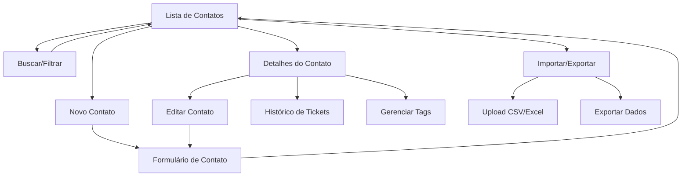

# Módulo de Gerenciamento de Clientes/Contatos - PRD

## 1. Visão Geral do Produto

O módulo de gerenciamento de clientes/contatos é uma funcionalidade essencial do sistema CRM que permite centralizar e organizar todas as informações de contatos da empresa. O módulo oferece operações CRUD completas, busca avançada, histórico de interações e integração total com o sistema de tickets existente.

- **Objetivo Principal**: Centralizar o gerenciamento de contatos para melhorar o relacionamento com clientes e otimizar o atendimento.
- **Público-Alvo**: Equipes de vendas, atendimento ao cliente e gestores que precisam acessar e gerenciar informações de contatos.
- **Valor de Mercado**: Aumentar a eficiência operacional em 40% através da centralização de dados de contatos e histórico de interações.

## 2. Funcionalidades Principais

### 2.1 Papéis de Usuário

| Papel | Método de Registro | Permissões Principais |
|-------|-------------------|----------------------|
| Usuário Padrão | Login com credenciais existentes | Visualizar e editar contatos, criar novos contatos |
| Administrador | Acesso administrativo | Todas as permissões + excluir contatos, gerenciar importação/exportação |

### 2.2 Módulo de Funcionalidades

Nossos requisitos do módulo de clientes consistem nas seguintes páginas principais:

1. **Lista de Contatos**: visualização em grid/lista, filtros avançados, busca em tempo real, paginação.
2. **Detalhes do Contato**: informações completas, histórico de tickets, notas, tags, ações rápidas.
3. **Formulário de Contato**: criação e edição de contatos, validação de campos, upload de avatar.
4. **Importação/Exportação**: upload de arquivos CSV/Excel, mapeamento de campos, exportação personalizada.

### 2.3 Detalhes das Páginas

| Nome da Página | Nome do Módulo | Descrição da Funcionalidade |
|----------------|----------------|-----------------------------|
| Lista de Contatos | Grid de Contatos | Exibir contatos em formato de tabela/cards com busca, filtros por tags/empresa/status, ordenação por nome/data |
| Lista de Contatos | Barra de Busca | Busca em tempo real por nome, email, telefone ou empresa com sugestões automáticas |
| Lista de Contatos | Filtros Avançados | Filtrar por tags, empresa, data de criação, último contato, status ativo/inativo |
| Detalhes do Contato | Informações Pessoais | Exibir e editar nome, email, telefone, empresa, cargo, endereço completo |
| Detalhes do Contato | Histórico de Tickets | Listar todos os tickets relacionados ao contato com status e datas |
| Detalhes do Contato | Sistema de Tags | Adicionar, remover e gerenciar tags personalizadas para categorização |
| Detalhes do Contato | Notas e Observações | Campo de texto livre para anotações importantes sobre o contato |
| Formulário de Contato | Validação de Dados | Validar formato de email, telefone, campos obrigatórios com feedback visual |
| Formulário de Contato | Upload de Avatar | Permitir upload de foto do contato com redimensionamento automático |
| Importação/Exportação | Upload de Arquivo | Importar contatos via CSV/Excel com preview e validação de dados |
| Importação/Exportação | Mapeamento de Campos | Interface para mapear colunas do arquivo com campos do sistema |
| Importação/Exportação | Exportação Personalizada | Exportar contatos selecionados em formato CSV/Excel com campos customizáveis |

## 3. Processo Principal

**Fluxo do Usuário Padrão:**
O usuário acessa a lista de contatos, utiliza filtros ou busca para encontrar contatos específicos, visualiza detalhes completos incluindo histórico de tickets, edita informações quando necessário, adiciona notas ou tags para melhor organização, e cria novos contatos conforme demanda.

**Fluxo do Administrador:**
Além das funcionalidades do usuário padrão, o administrador pode importar contatos em lote via arquivo CSV/Excel, mapear campos durante a importação, exportar dados para relatórios, e gerenciar contatos inativos ou duplicados.

## 4. Design da Interface do Usuário

### 4.1 Estilo de Design

- **Cores Primárias**: #3B82F6 (azul primário), #1E40AF (azul escuro)
- **Cores Secundárias**: #F3F4F6 (cinza claro), #6B7280 (cinza médio)
- **Estilo de Botões**: Rounded corners (8px), hover effects, loading states
- **Fonte**: Inter, tamanhos 14px (corpo), 16px (títulos), 12px (labels)
- **Layout**: Card-based design, navegação lateral, grid responsivo
- **Ícones**: Lucide React icons, tamanho 16px-24px, estilo outline

### 4.2 Visão Geral do Design das Páginas

| Nome da Página | Nome do Módulo | Elementos da UI |
|----------------|----------------|----------------|
| Lista de Contatos | Grid de Contatos | Tabela responsiva com avatar, nome, email, empresa, tags coloridas, ações (editar/visualizar) |
| Lista de Contatos | Barra de Busca | Input com ícone de lupa, placeholder "Buscar por nome, email...", sugestões dropdown |
| Lista de Contatos | Filtros | Sidebar com checkboxes para tags, select para empresa, date picker para período |
| Detalhes do Contato | Card Principal | Layout em duas colunas, avatar grande, informações organizadas em seções |
| Detalhes do Contato | Histórico | Timeline vertical com cards de tickets, status coloridos, datas relativas |
| Formulário de Contato | Campos | Form layout responsivo, labels flutuantes, validação em tempo real, botões de ação |
| Importação | Upload Area | Drag & drop zone, progress bar, preview table, botões de confirmação |

### 4.3 Responsividade

O módulo é projetado com abordagem mobile-first, adaptando-se automaticamente para tablets e desktops. Em dispositivos móveis, a tabela se transforma em cards verticais, filtros ficam em modal, e a navegação é otimizada para toque.
