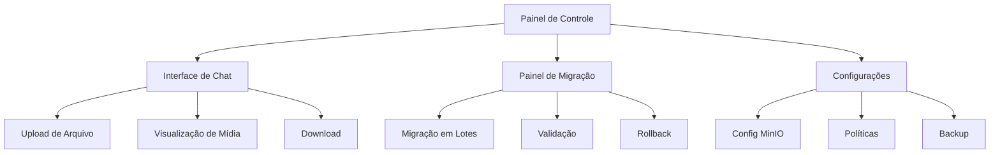

# Requisitos de Produto: Migração para MinIO

## 1. Visão Geral do Produto

Este documento define os requisitos para migração do sistema de armazenamento de arquivos do CRM do Firebase Storage para MinIO, mantendo uma arquitetura híbrida que preserva os dados de negócio no Firebase e migra apenas os arquivos de mídia para MinIO. O objetivo é reduzir custos operacionais e melhorar a performance de upload/download, suportando exclusivamente os formatos: PDF, XML, áudio OGG, imagens JPEG e vídeos.

## 2. Funcionalidades Principais

### 2.1 Papéis de Usuário

| Papel | Método de Acesso | Permissões Principais |
|-------|------------------|----------------------|
| Agente de Atendimento | Login com credenciais | Upload/download de arquivos, visualização de mídias |
| Supervisor | Login com credenciais | Todas as permissões do agente + relatórios de uso |
| Administrador | Login com credenciais | Configuração do sistema, migração de dados, métricas |
| Cliente (WhatsApp) | Automático via webhook | Envio de arquivos através do chat |

### 2.2 Módulos Funcionais

O sistema de migração MinIO consiste nas seguintes páginas principais:

1. **Painel de Controle de Mídia**: gerenciamento de uploads, visualização de estatísticas, monitoramento de armazenamento
2. **Interface de Chat**: upload de arquivos via drag-and-drop, visualização de mídias, download de documentos
3. **Painel de Migração**: ferramentas de migração, status de progresso, validação de integridade
4. **Configurações de Sistema**: configuração MinIO, políticas de armazenamento, limites de arquivo

### 2.3 Detalhes das Páginas

| Nome da Página | Nome do Módulo | Descrição da Funcionalidade |
|----------------|----------------|-----------------------------|
| Painel de Controle | Dashboard de Mídia | Exibir estatísticas de uso, espaço ocupado, tipos de arquivo mais comuns, gráficos de upload/download |
| Painel de Controle | Monitor de Performance | Mostrar tempo de resposta, taxa de sucesso, alertas de sistema, status do MinIO |
| Interface de Chat | Upload de Arquivos | Arrastar e soltar arquivos, validação em tempo real, barra de progresso, preview de imagens |
| Interface de Chat | Visualizador de Mídia | Reproduzir áudios OGG, visualizar PDFs inline, download direto, thumbnails para vídeos |
| Interface de Chat | Histórico de Arquivos | Listar todos os arquivos do ticket, filtrar por tipo, buscar por nome, ordenar por data |
| Painel de Migração | Assistente de Migração | Executar migração em lotes, validar integridade, rollback automático, logs detalhados |
| Painel de Migração | Status de Progresso | Barra de progresso global, estatísticas por tipo de arquivo, tempo estimado, erros encontrados |
| Configurações | Configuração MinIO | Definir credenciais, testar conexão, configurar buckets, políticas de retenção |
| Configurações | Políticas de Arquivo | Definir tamanhos máximos, formatos permitidos, regras de validação, quotas por usuário |
| Configurações | Backup e Segurança | Configurar backups automáticos, criptografia, controle de acesso, auditoria |

## 3. Fluxos Principais

### 3.1 Fluxo de Upload de Arquivo (Agente)

1. Agente acessa interface de chat do ticket
2. Arrasta arquivo para área de upload ou clica em "Anexar"
3. Sistema valida formato e tamanho do arquivo
4. Se válido, exibe preview e barra de progresso
5. Arquivo é enviado para MinIO com metadados
6. URL do MinIO é salva no Firebase Firestore
7. Arquivo aparece no chat com opções de download/visualização

### 3.2 Fluxo de Recebimento via WhatsApp

1. Cliente envia arquivo via WhatsApp
2. Evolution API recebe webhook com dados do arquivo
3. Sistema baixa arquivo da URL temporária do WhatsApp
4. Valida formato e converte se necessário (ex: jpegThumbnail)
5. Upload para MinIO com categorização automática
6. Salva referência no Firebase com dados da mensagem
7. Arquivo aparece no chat do agente

### 3.3 Fluxo de Migração de Dados

1. Administrador acessa painel de migração
2. Sistema escaneia Firebase Storage para arquivos existentes
3. Exibe relatório com quantidade e tipos de arquivos
4. Administrador configura parâmetros de migração
5. Processo executa em lotes com validação
6. Sistema atualiza referências no Firestore
7. Validação final de integridade
8. Relatório de migração completa

## 4. Design da Interface

### 4.1 Estilo de Design

- **Cores Primárias**: Azul (#2563eb) para ações principais, Verde (#16a34a) para sucesso
- **Cores Secundárias**: Cinza (#6b7280) para texto, Vermelho (#dc2626) para erros
- **Estilo de Botões**: Arredondados com sombra sutil, hover com transição suave
- **Fontes**: Inter para interface, tamanhos 14px (corpo), 16px (títulos), 12px (legendas)
- **Layout**: Design baseado em cards, navegação lateral fixa, responsivo mobile-first
- **Ícones**: Lucide React para consistência, estilo outline

### 4.2 Visão Geral do Design das Páginas

| Nome da Página | Nome do Módulo | Elementos de UI |
|----------------|----------------|----------------|
| Painel de Controle | Dashboard de Mídia | Cards com estatísticas, gráficos de linha/pizza, cores azul/verde, ícones de arquivo, animações suaves |
| Painel de Controle | Monitor de Performance | Indicadores de status (verde/vermelho), métricas em tempo real, alertas com badges, gráfico de linha temporal |
| Interface de Chat | Upload de Arquivos | Área de drag-and-drop com borda tracejada, barra de progresso azul, preview de imagens, botão "Anexar" arredondado |
| Interface de Chat | Visualizador de Mídia | Player de áudio customizado, viewer de PDF inline, thumbnails de vídeo, botões de download com ícones |
| Interface de Chat | Histórico de Arquivos | Lista com ícones por tipo, filtros dropdown, busca com lupa, ordenação por data, paginação |
| Painel de Migração | Assistente de Migração | Wizard com steps, barra de progresso global, cards de status, botões de ação destacados |
| Painel de Migração | Status de Progresso | Dashboard com métricas, logs em tempo real, indicadores visuais, botão de pausa/retomar |
| Configurações | Configuração MinIO | Formulário estruturado, campos de validação, botão "Testar Conexão", indicadores de status |
| Configurações | Políticas de Arquivo | Tabela editável, sliders para tamanhos, toggles para formatos, preview de regras |
| Configurações | Backup e Segurança | Cards de configuração, switches para opções, calendário para agendamento, logs de auditoria |

### 4.3 Responsividade

O sistema é **desktop-first** com adaptação mobile completa:
- **Desktop (1200px+)**: Layout completo com sidebar, múltiplas colunas
- **Tablet (768px-1199px)**: Sidebar colapsível, layout de 2 colunas
- **Mobile (320px-767px)**: Navegação bottom sheet, layout single column, touch otimizado
- **Interações Touch**: Swipe para ações, long press para contexto, gestos de zoom para imagens

## 5. Requisitos Funcionais Detalhados

### 5.1 Upload de Arquivos

**RF001 - Validação de Formato**
- O sistema DEVE aceitar apenas: PDF, XML, OGG, JPEG, MP4, WebM, AVI, MOV
- O sistema DEVE rejeitar outros formatos com mensagem explicativa
- O sistema DEVE detectar o tipo real do arquivo (não apenas extensão)

**RF002 - Validação de Tamanho**
- PDF: máximo 50MB
- XML: máximo 10MB
- OGG: máximo 100MB
- JPEG: máximo 20MB
- Vídeos: máximo 500MB

**RF003 - Upload com Progresso**
- O sistema DEVE exibir barra de progresso durante upload
- O sistema DEVE permitir cancelamento de upload
- O sistema DEVE mostrar velocidade de upload estimada

**RF004 - Preview de Arquivos**
- Imagens JPEG: thumbnail automático
- PDFs: primeira página como preview
- Vídeos: frame inicial como thumbnail
- Áudios: waveform visual

### 5.2 Armazenamento e Organização

**RF005 - Estrutura de Pastas**
- Organização por tipo: /images/, /documents/pdf/, /audio/ogg/, /videos/
- Subpastas por data: /YYYY/MM/
- Nomes únicos com timestamp

**RF006 - Metadados**
- Nome original do arquivo
- Tamanho em bytes
- Tipo MIME detectado
- Checksum MD5 para integridade
- Data/hora de upload
- Usuário responsável

**RF007 - URLs de Acesso**
- URLs diretas para download
- URLs presignadas para segurança
- Cache de URLs por 1 hora

### 5.3 Migração de Dados

**RF008 - Migração em Lotes**
- Processar 50 arquivos por lote
- Pausar/retomar migração
- Rollback automático em caso de erro

**RF009 - Validação de Integridade**
- Comparar checksums antes/depois
- Verificar tamanhos de arquivo
- Testar URLs de acesso

**RF010 - Atualização de Referências**
- Atualizar URLs no Firestore
- Manter histórico de migração
- Marcar arquivos como migrados

### 5.4 Segurança e Controle

**RF011 - Controle de Acesso**
- Autenticação obrigatória para upload
- Logs de todas as operações
- Rate limiting por usuário

**RF012 - Validação de Segurança**
- Scan de malware em uploads
- Validação de assinaturas de arquivo
- Quarentena para arquivos suspeitos

**RF013 - Backup e Recuperação**
- Backup diário automático
- Retenção de 30 dias
- Teste de restauração mensal

## 6. Requisitos Não Funcionais

### 6.1 Performance

**RNF001 - Tempo de Resposta**
- Upload: máximo 30 segundos para arquivos de 100MB
- Download: início em menos de 2 segundos
- Listagem: máximo 1 segundo para 100 arquivos

**RNF002 - Throughput**
- Suportar 50 uploads simultâneos
- Bandwidth mínimo de 100 Mbps
- Cache de metadados por 5 minutos

### 6.2 Disponibilidade

**RNF003 - Uptime**
- 99.9% de disponibilidade mensal
- Máximo 4 horas de manutenção por mês
- Failover automático em 30 segundos

**RNF004 - Monitoramento**
- Alertas para falhas de upload > 5%
- Monitoramento de espaço em disco
- Logs estruturados para análise

### 6.3 Escalabilidade

**RNF005 - Capacidade**
- Suportar até 1TB de arquivos
- Crescimento de 100GB por mês
- Máximo 10.000 arquivos por dia

**RNF006 - Otimização**
- Compressão automática de imagens
- CDN para distribuição global
- Cache inteligente por região

## 7. Critérios de Aceitação

### 7.1 Upload de Arquivos

✅ **Cenário 1**: Upload de PDF válido
- **Dado** que tenho um arquivo PDF de 10MB
- **Quando** faço upload via interface
- **Então** o arquivo é aceito e salvo no MinIO
- **E** a URL é salva no Firestore
- **E** o arquivo aparece no chat

✅ **Cenário 2**: Rejeição de formato inválido
- **Dado** que tenho um arquivo .exe
- **Quando** tento fazer upload
- **Então** recebo mensagem de erro
- **E** o upload é rejeitado
- **E** nenhum arquivo é salvo

### 7.2 Migração de Dados

✅ **Cenário 3**: Migração bem-sucedida
- **Dado** que tenho 100 arquivos no Firebase
- **Quando** executo a migração
- **Então** todos os arquivos são transferidos
- **E** as URLs são atualizadas no Firestore
- **E** os arquivos permanecem acessíveis

✅ **Cenário 4**: Rollback por erro
- **Dado** que a migração falha em 50%
- **Quando** o sistema detecta o erro
- **Então** executa rollback automático
- **E** restaura estado anterior
- **E** notifica o administrador

### 7.3 Performance

✅ **Cenário 5**: Upload de arquivo grande
- **Dado** que tenho um vídeo de 400MB
- **Quando** faço upload
- **Então** o processo completa em menos de 25 segundos
- **E** a barra de progresso é atualizada
- **E** posso cancelar se necessário

## 8. Plano de Testes

### 8.1 Testes Unitários
- Validação de formatos de arquivo
- Geração de nomes únicos
- Cálculo de checksums
- Categorização por tipo MIME

### 8.2 Testes de Integração
- Upload completo (Frontend → API → MinIO → Firestore)
- Download via URL presignada
- Migração de lote pequeno
- Sincronização de metadados

### 8.3 Testes de Performance
- Upload de 50 arquivos simultâneos
- Download de arquivo de 500MB
- Migração de 1000 arquivos
- Stress test com 100 usuários

### 8.4 Testes de Segurança
- Upload de arquivo malicioso
- Tentativa de acesso não autorizado
- Validação de tipos MIME falsos
- Teste de rate limiting

## 9. Cronograma de Entrega

### Fase 1: Infraestrutura (Dias 1-2)
- [ ] Configuração do MinIO
- [ ] Implementação dos serviços base
- [ ] Testes de conectividade

### Fase 2: APIs e Validação (Dias 3-4)
- [ ] Endpoints de upload/download
- [ ] Sistema de validação avançado
- [ ] Testes unitários

### Fase 3: Interface de Usuário (Dias 5-6)
- [ ] Componentes de upload
- [ ] Visualizadores de mídia
- [ ] Painel de controle

### Fase 4: Migração (Dias 7-8)
- [ ] Scripts de migração
- [ ] Validação de integridade
- [ ] Testes de rollback

### Fase 5: Finalização (Dias 9-10)
- [ ] Testes de integração completos
- [ ] Documentação final
- [ ] Deploy em produção

---

**Status**: Requisitos de produto completos e detalhados
**Próximos Passos**: Iniciar implementação seguindo as especificações
**Estimativa Total**: 10 dias úteis para implementação completa